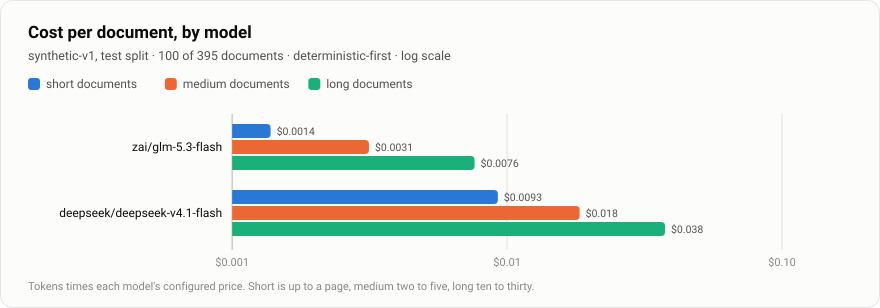
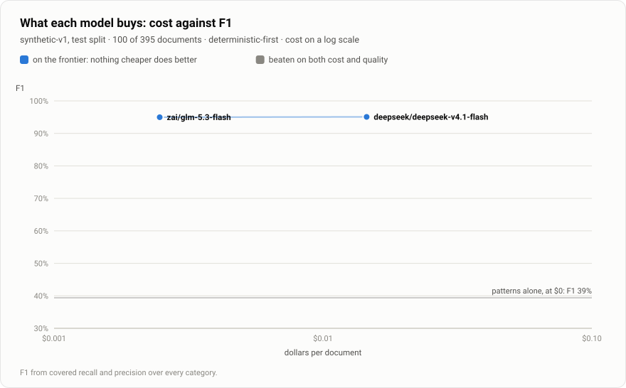
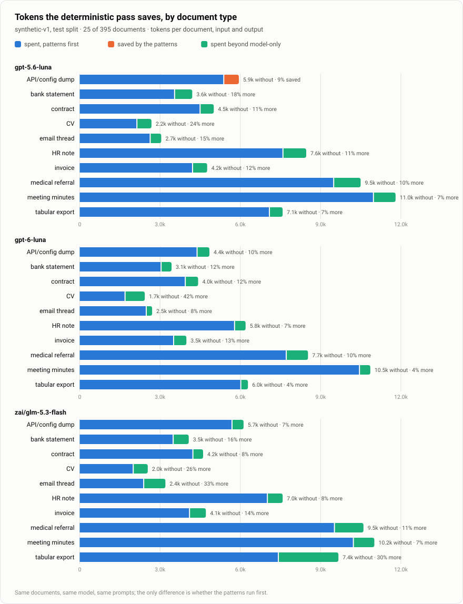
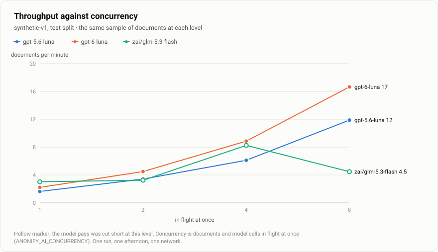
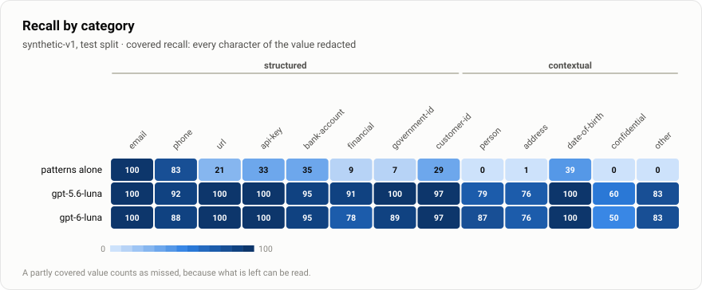
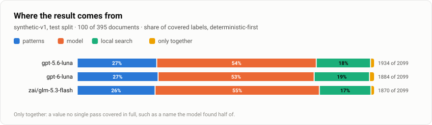
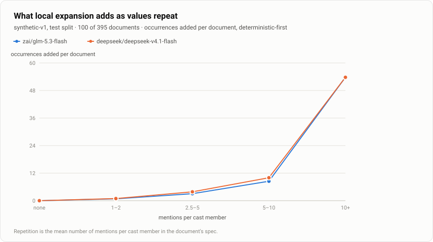
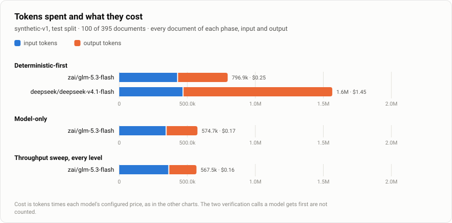

# Benchmarks

Precision and recall need ground truth. This directory holds the tooling for a
**synthetic, labelled PII corpus** ([#57](https://github.com/Anonify-v2-0/Anonify2.0/issues/57)),
which the per-category quality benchmark (#59) and the cost benchmark (#55)
are measured against.

The corpus is generated by a cheap model, and its labels come from **how it was
generated** rather than from anyone reading it afterwards. Every email address,
phone number, URL and IP address in it is from a range reserved for fiction or
documentation, and CI fails if one is not. Other values with a checkable
format, such as cards and national IDs, come from a range reserved for fiction
wherever one exists. Where none does, as for IBANs and most national IDs, they
are random and can coincide with a real one; see
[_Where no reserved range exists_](#reserved-ranges).

|                                                                                                     | Status                                        |
| --------------------------------------------------------------------------------------------------- | --------------------------------------------- |
| `corpus/generate.ts`: spec sampler, prompt, placeholder filler, markup stripper, rejection checks   | done                                          |
| `corpus/validate.ts`: cross-family validator, disagreements queued for a person                     | done                                          |
| `corpus/check.ts`: CI check that committed files hold only reserved values                          | done, runs in the `Test` job                  |
| `corpus/synthetic-v1.tar.gz`: the 600 documents, with `manifest.json` beside it                     | 534 of 600; validated, 244 reviews open       |
| `corpus/render.ts`: txt / eml / pdf / docx / csv / xlsx                                             | done; `corpus:score --format` reads them back |
| `score.ts`: per-category precision and recall, weighted cost, agreement                             | done                                          |
| `models.ts`: models against each other, and deterministic-first against model-only (#59, #55)       | done; three models on 100 test documents      |
| `charts.ts`: the five charts in CONTRIBUTING §4, two for #55, and tokens and cost, from the results | done; see [Results](#results)                 |

## Generating

The model is reached through a command-line agent you are already signed in to:
[Claude Code](https://docs.claude.com/en/docs/claude-code) or
[Codex](https://github.com/openai/codex). The script reads no API key; the CLI
brings its own credentials, subscription or key.

```sh
pnpm corpus:generate --dry-run                    # the distribution, and the first specs
pnpm corpus:generate --dry-run --ids syn-v1-0042  # that document's prompt
pnpm corpus:generate --limit 10                   # ten documents, to see the rejection rate
pnpm corpus:generate                              # the rest; safe to interrupt and rerun
```

| Backend                                 | Runs                                                        | Default model      |
| --------------------------------------- | ----------------------------------------------------------- | ------------------ |
| `--backend claude` (default)            | `claude -p --output-format json --json-schema … --tools ""` | `claude-haiku-4-5` |
| `--backend codex`                       | `codex exec --sandbox read-only --output-schema … -`        | `gpt-5-mini`       |
| `--backend command --command '<shell>'` | any command that reads the prompt on stdin and prints JSON  | —                  |

Each call runs in an empty temporary directory, so the CLI picks up no project
instructions and has nothing to read. `--model` picks the model, and
`--backend-arg` passes anything else through to the CLI.

On Windows the CLI is looked up along `PATH` the way Windows does it. A CLI
installed with npm, pnpm or yarn is a `.cmd` wrapper there, so the Node script
it names is run directly, with every argument intact; an `.exe` is run as it is.

**Seeded and resumable.** `--seed` (default 57) decides every document's spec
and every value the script fills in. A document already on disk is skipped.
Every model response is cached under `corpus/.cache/` (ignored by git) before
it is checked, so an interrupted run loses at most the calls in flight, and
after a fix to the checks `pnpm corpus:generate --rebuild` re-derives the whole
corpus from cached responses without calling a model. A document that no cached
response passes any more is removed. A document a person has reviewed is kept
as it is, and so is one with no cached response to rebuild it from; both are
held to the current checks, and the rebuild names any that fail and exits
non-zero. `--force` leaves reviewed documents alone too: delete the file to
regenerate one.

A rerun does not call the model again for a document that has already used
its `--attempts`: its cached responses are checked again, and fail again. To
retry the documents that gave up, raise it (`--attempts 5`). The new attempts
are told why the last cached one was rejected.

**Speed.** The first full run, with Codex and GPT 6 Luna at the reasoning
effort set in `~/.codex/config.toml` (`high`), took about 90 seconds a call
and seven hours for 1,106 calls: 470 documents written, 130 given up after
three attempts. A later run wrote 64 of those 130, bringing the corpus to
534. Three things now cut that:

- `--effort` sets Codex's reasoning effort for the corpus alone, and defaults
  to `low`. `--effort config` uses your config file instead.
- A retry's prompt ends with the reasons its previous draft was rejected,
  instead of drawing again blind. Most rejections in that run were an
  unmarked repeat of a name or ID, or a required category left out, which a
  model fixes when told. The reasons are recorded in the cached response as
  `feedback`. A reason that names the operator is replaced by a generic one.
- The longest documents are started first, so a run does not end with every
  worker idle but one.

`--concurrency` (default 4) is the other lever, up to whatever rate your CLI's
plan allows.

In a terminal, the run shows a progress bar, what each worker is writing and
for how long, an estimate of the time left, and a running count of why drafts
are rejected. Piped or in CI it prints one plain line per event instead.
`NO_COLOR` turns colour off.

**Cost.** In trials with Claude Code and Haiku 4.5, a short or medium document
cost $0.007–0.016 a call and a long one $0.03–0.05. Between a third and a half
of calls were rejected and retried. For 600 documents that comes to roughly
$20–30. Extended thinking is off unless you ask for it with `--thinking
<tokens>`. It was about 90% of the output tokens on this task and made no
difference the checks could see. The budget is a flag rather than read from
`MAX_THINKING_TOKENS`, because a shell inside a Claude Code session exports its
own.

**Your identity stays out.** Claude Code sends the signed-in account's email
address to the model as context, even with `--system-prompt`. In a trial, the
model used it as a character's address. The script collects what identifies
you: the Claude Code and Codex account files, `git config user.name` and
`user.email`, your OS username, anything in `CORPUS_DENY`, and each `--deny
<text>`. It then rejects any document that mentions an email from that list, a
name part of four letters or more, or a whole name in either order however
short its parts ("Tom Lee", "Lee, Tom"). The email alone would be caught by the
reserved-range check, but a name derived from it would not be. If your name
could reach the model some other way, pass it with `--deny`.

### What each document gets

The spec sampler deals out the distributions in #57 exactly, not on average:
150 dev and 450 test documents; 50% short, 35% medium and 15% long; PII density
none, low, medium and high at 10, 30, 40 and 20%; en-US 45%, en-GB 25% and
de-DE, fr-FR, es-ES and en-IN 7.5% each; twelve document types, 50 each. Each
document also gets a cast with a mention count per person (the first repeats
most, up to 20 in a long document), the categories it must include, weighted
towards the ones its type carries naturally and towards the rare `api-key` and
`date-of-birth`, and a set of hard negatives.

### The prompt

[`corpus/lib/prompt.ts`](corpus/lib/prompt.ts) is the prompt from #57, with
these additions, all in prompt version 1:

- placeholders for URLs, IP addresses, sort codes and routing numbers, and
  typed identity placeholders (`{{NATIONAL_ID}}`, `{{TAX_ID}}`, `{{PASSPORT}}`,
  `{{DRIVING_LICENCE}}`, `{{HEALTH_ID}}`), so a line that says "SSN:" is
  followed by an SSN;
- `:person-id` on any placeholder, so a person's number can repeat;
- a rule that every domain is under `example.com`, `.org` or `.net`, and that
  phone numbers and emails are always marked up;
- a rule that people outside the cast are marked up too. Without it, models add
  attendees and signatories and leave them unlabelled.

### What is rejected

A response is rejected, and retried up to `--attempts` times, when:

- the JSON does not match the schema;
- the markup is malformed: unclosed, nested, an unknown category or placeholder,
  a placeholder under the wrong category, or `{{…}}` outside markup;
- **anything in the text looks real**: an email, phone number, URL or IP address
  outside the reserved ranges, labelled or not, unless the script filled it in;
- it mentions the operator (see above);
- a value is labelled once and appears unlabelled elsewhere, or a cast
  member's first or last name does;
- a required category or cast member is missing, a "none" document has any
  labels, or none of its hard negatives appear verbatim;
- the length is outside its bucket.

Three slips have exactly one reading and are repaired rather than rejected:

- `[[email|{{EMAIL}}}]` or `}}}}` for `[[email|{{EMAIL}}]]`;
- a bare `{{PHONE}}` for `[[phone|{{PHONE}}]]`, since the placeholder names its
  own category and the value is the script's;
- an unmarked email or phone number in a reserved range, such as
  `noreply@alerts.example.com` in a config file, which is labelled as `email`
  or `phone`: its shape is its category, and its range says nobody owns it.

Each label is still correct by construction. The count is recorded as
`generator.markupRepairs`.

Every rejection reason is appended to `corpus/.cache/<corpus>/rejects.jsonl`.

### Reserved ranges

[`corpus/lib/reserved.ts`](corpus/lib/reserved.ts) is the single answer to
"may this value appear in the corpus?".

| Values       | From                                                                                                                          |
| ------------ | ----------------------------------------------------------------------------------------------------------------------------- |
| Email, URL   | `example.com`, `example.net`, `example.org` and subdomains, and the `.example`, `.test`, `.invalid` TLDs (RFC 2606, RFC 6761) |
| IP address   | 192.0.2.0/24, 198.51.100.0/24, 203.0.113.0/24 (RFC 5737), 2001:db8::/32 (RFC 3849)                                            |
| Phone, en-US | 555-0100 to 555-0199 in any area code (NANPA)                                                                                 |
| Phone, en-GB | Ofcom drama numbers: 07700 900xxx, 020 7946 0xxx, 01x1 496 0xxx, 01632 960xxx                                                 |
| Phone, de-DE | Bundesnetzagentur drama numbers: 030 23125xxx, 069 90009xxx, 040 66969xxx, 0221 4710xxx, 089 99998xxx                         |
| Phone, fr-FR | ARCEP numbers for audiovisual works: 01 99 00, 02 61 91, 03 53 01, 04 65 71, 05 36 49, 06 39 98 + four digits                 |
| Phone, es-ES | none exists: an Ofcom drama number above, dialled from abroad (+44 7700 900xxx, 0044 20 7946 0xxx)                            |
| Phone, en-IN | none exists: as es-ES                                                                                                         |
| Card         | processors' published test numbers (4111 1111 1111 1111, 5555 5555 5555 4444, …)                                              |
| SSN          | 987-65-4320 to 987-65-4329, which SSA reserves for advertising                                                                |
| UK NI number | the QQ prefix, which is never issued                                                                                          |
| NHS number   | the 999 range, which is reserved for testing                                                                                  |

A phone number is judged by its own country's ranges: an international one by
its country code, a national one by the document's locale. 020 7946 0123 is a
drama number in an en-GB document but not in an en-US one, and +44 302 312 5123
is not reserved anywhere, although its national digits are a German drama
number.

**Where no reserved range exists**, values are random but format- and
checksum-valid: IBANs, account numbers, and national IDs other than the three
above (Steuer-ID, NIR, DNI, Aadhaar, PAN, passports, licences). A random value
can be one that has been issued. For some it often will be: DNI numbers are
issued roughly in sequence and a large share of the range is in use, and
Aadhaar numbers and Steuer-IDs, though sparser, can be hit too over several
hundred documents. Such a value is somebody's number, but nothing else in the
document is theirs: the name, address and every other value next to it are
generated separately. Unlike an email or a phone number, none of these can be
told from a real one by looking, so neither the generator nor the CI check can
catch one the model wrote itself; the prompt asks for a placeholder instead.

Spain and India reserve no phone numbers for fiction either, and both allocate
mobile numbers so densely that a random one is often somebody's. So a phone
number in an es-ES or en-IN document is a UK drama number, written as it is
dialled from abroad: a contact in the UK. The corpus therefore measures no
Spanish or Indian number formats.

One consequence for #59: the deterministic SSN detector
(`plausibleSsn` in `lib/redaction/detectors.ts`) rejects area numbers 900 and
above, so it will miss every SSN in this corpus, because all of them come from
the reserved 987 block. That is arguably a detector bug, since the reserved
block is exactly what appears in sample documents, but it needs deciding before
the numbers are read.

## The archive

The documents are committed as one archive, `corpus/synthetic-v1.tar.gz`: 2.0
MB for the 534 documents, where the loose files would be 6.9 MB and 534
objects in every clone. `corpus/synthetic-v1/manifest.json` stays beside it in
plain text, so what the corpus holds and the hash of every file in it can
still be read and diffed on GitHub. The directory `corpus/synthetic-v1/` is the
working copy, and git ignores everything in it but the manifest.

You do not need to unpack it yourself. `corpus:generate`, `corpus:validate`
and `corpus:score` bring the working copy up to date with the archive before
they read it, and `generate` and `validate` pack it again after writing to
it. Commit the archive together with `manifest.json`.

```sh
pnpm corpus:unpack          # archive → working copy
pnpm corpus:status          # what differs between the two
pnpm corpus:pack            # working copy → archive, after a change by hand
pnpm corpus:unpack --force  # discard local changes and take the archive
```

It is a plain tarball, so `tar -xzf benchmarks/corpus/synthetic-v1.tar.gz -C
benchmarks/corpus` works as well.

Bringing the working copy up to date merges rather than overwrites. A file
only the archive changed is updated, one only you changed is kept, and one
both changed is kept as yours and named, so pulling someone else's corpus work
never loses yours. A document you deleted stays deleted, which is how you
regenerate one. An empty working copy, as after a fresh clone or a branch
switch, is unpacked whole. `corpus:check` fails while the working copy and the
archive differ, so a hand edit that was never packed cannot be committed by
accident.

Two costs of the archive:

- Every change to the corpus is a new 1–2 MB blob in history, where loose
  files would store only the documents that changed. Pack after a batch of
  work, not after each document.
- GitHub's secret scanning does not look inside the archive, and it had
  flagged the generator's Stripe-shaped test keys (`sk_test_…`) as live
  secrets. `corpus:check`, which reads the archive file by file in CI, is the
  guard on what the corpus holds.

## The label format

One file per document, `<split>/<id>.json` in the archive and
`corpus/synthetic-v1/<split>/<id>.json` once unpacked:

```jsonc
{
  "id": "syn-v1-0042",
  "split": "test", // "dev": free to look at; "test": frozen
  "title": "Re: your refund", // metadata, never rendered into the document
  "docType": "email thread",
  "docTypeDetail": "support email thread, 4 messages",
  "locale": "en-GB",
  "length": "medium", // short | medium | long
  "density": "medium", // none | low | medium | high
  "render": ["eml", "pdf", "txt"], // formats the harness renders it to
  "words": 1180,
  "text": "…", // markup stripped
  "spans": [
    {
      "start": 118,
      "end": 129,
      "category": "person",
      "value": "Priya Raman",
      "entity": "p1",
    },
    {
      "start": 402,
      "end": 425,
      "category": "email",
      "value": "priya.raman@example.org",
      "entity": "p1",
      "placeholder": "EMAIL",
    },
  ],
  "negatives": [{ "start": 610, "end": 621, "value": "INV-2291-07" }],
  "entities": [
    {
      "id": "p1",
      "name": "Priya Raman",
      "role": "customer",
      "requested": 9,
      "mentions": 8,
    },
  ],
  "spec": {
    "mustInclude": ["email", "customer-id"],
    "negatives": ["an invoice number"],
    "targetWords": 1200,
  },
  "generator": {
    "backend": "claude",
    "model": "claude-haiku-4-5",
    "promptVersion": "1",
    "seed": 57,
    "attempt": 1,
    "markupRepairs": 0,
    "reviewedByHuman": false,
  },
}
```

- Offsets are JavaScript string indices (UTF-16 code units) into `text`, and
  `text.slice(start, end) === value` for every span. Spans do not overlap.
- `entity` names the cast member a value belongs to, when it can be told: from
  a placeholder's `:p1`, or a name whose every part belongs to exactly one cast
  member. "M. Rodriguez" with two Rodriguezes in the cast gets none.
- `placeholder` marks a value the script generated.
- `entities[].mentions` counts labelled person spans, which #55 uses as the
  repeat rate; `requested` is what the spec asked for.
- `negatives` are the look-alikes the model says it included, found verbatim
  and not overlapping a label. A detection over one is a false positive.

`manifest.json` counts documents by split, locale, type, length and density,
spans by category and split, and whether each category meets its test-split
target (400, or 250 for `api-key` and `date-of-birth`). It also holds a SHA-256
of every file. Benchmark results cite its `corpus` hash, which is the hash of
that file list. `pnpm corpus:generate --manifest` rewrites it.

## Validation and human review

```sh
pnpm corpus:validate                    # Codex reviews a corpus Claude wrote
pnpm corpus:validate --backend claude   # or the other way round
```

A model from a different family reads each document with its labels inline
and names anything it thinks is personal data but unlabelled, or labelled but
wrong. It changes nothing. Each document it disagrees with gets
`review/<id>.json`, with every claim tied to offsets, for a person to settle by
editing the labels, setting `generator.reviewedByHuman`, recording what was
changed and which claims were wrong under `resolution`, and setting `status`
from `"open"` to `"resolved"`. `review/validated.json` records which file hash
was validated by which model, so an edited document is validated again.

A later pass never overwrites a person's work. It appends to the review's
`revalidations`, listing under `disagreements` only claims the file does not
already hold. A claim the person has already rejected is recorded under
`repeated` and leaves a resolved review resolved; a new claim reopens it, with
its `resolution` kept. When a document with an open review has changed and the
next pass flags nothing, the review is marked `"superseded"` rather than
deleted. Only a review nobody has touched, of a version of the document that
is gone, is replaced outright. A second validator run over the same corpus
therefore adds its claims to the first one's.

`review/spot-check.json` names the 10% of the test split a person checks
whether or not anything was flagged, and logs who checked each, when, and what
changed. `drawnFrom` is the size of the split it is a tenth of. When the split
grows, as it does after a trial run, the sample is topped up from documents not
yet in it, and those already chosen stay.

In trials this pass caught exactly what the generator's checks cannot: names
of people outside the cast left unlabelled.

## Checking

```sh
pnpm corpus:check
```

This runs in CI. It fails if any committed corpus file, or any free text in a
review file, contains an email address, phone number, URL or IP address outside
the reserved ranges; if a label does not match its text; or if a file does not
match its hash in `manifest.json`. It reads the committed archive file by file,
so nothing has to be unpacked first. Where a working copy exists too, it fails
if the two differ.

## Scoring

```sh
pnpm corpus:score                            # deterministic detectors, test split
pnpm corpus:score --detector pipeline        # the whole pipeline, with the benchmark's model
pnpm corpus:score --split dev --limit 20     # a quick look while iterating
pnpm corpus:score --format pdf               # through PDF rendering and the PDF extractor
pnpm corpus:score --rescore <results.json>   # today's scoring rules, stored detections
pnpm corpus:score --compare <a.json> <b.json>  # agreement between two runs
```

Each document goes through `analyzeDocument`, the function an upload goes
through. By default it is one plain-text page; with `--format` it is rendered
and read back first (see [Rendering](#rendering)). `patterns` runs it with the
model switched off, which is exactly what an install without a key does.

`pipeline` runs one model from the benchmark's own environment,
`benchmarks/.bench/.env`, as `bench:models` does, and never from `.env` (see
[The benchmark's own environment](#the-benchmarks-own-environment)). It runs
the saved model, or `--model provider:model` with that provider's key saved
there.

- **Several models saved:** in a terminal it asks which one; without a
  terminal, `--model` is required.
- **None saved:** in a terminal it asks for a provider and a model, as
  `bench:models` does, and saves the answer.

The model is verified with two small calls before the first document. One that
fails stops the run rather than scoring the patterns alone under its name.

The run's tokens are counted from the pipeline's own usage records. Those
records are not written to the instance's database, and the daily spend cap
does not apply. A cost is reported when the model has a price.

A detection is matched to a label by character overlap, as #57 specifies:

- **Recall (covered)**, the primary number: every character of the value is
  under a redaction, whitespace inside it aside. A value partly covered is a
  leak and counts as missed.
- **Overlap**: any redaction touches the value.
- **Strict**: the value is covered by redactions of its own category, so the
  gap to covered recall is "found it, called it the wrong thing".
- **Precision**: the share of redactions that touch a labelled value. One that
  touches none is a false positive, and so is one over a hard negative. It is
  counted once per region a reviewer would see: a redaction that lies inside
  another, `Raman` inside `Priya Raman` or inside `priya.raman@example.org`,
  is folded into the one around it first, so it adds neither a right answer
  nor a wrong one. Recall is read from every redaction; folding uncovers
  nothing. **This, per occurrence, is the headline precision.**
- **Precision per distinct value**, beside it: each (document, value,
  category) counted once, right if any of its occurrences is. A wrong call the
  local search copied to every row of a table is one decision here, and as
  many false positives in the headline.
- **At a confidence cut-off**: precision and recall from only the redactions
  at or above 0.5, 0.7, 0.8 and 0.9, which is what a reviewer would get by
  hiding the rest. Only for runs that recorded each detection's confidence,
  which `bench:models` does since #205.
- **Interval**: a run over part of the split gives a 95% interval for
  precision, recall and F1, from resampling its documents 2,000 times with a
  fixed seed, so the same results always give the same interval.
- **Weighted cost**: a missed `government-id`, `bank-account`, `financial` or
  `api-key` costs 10; a missed `person`, `address`, `date-of-birth`, `email`,
  `phone` or `customer-id` costs 5; any other miss costs 2, and a false
  positive 1 (`MISS_WEIGHTS` in `lib/scoring.ts`).
- **Agreement** between two runs: for each labelled value, whether both
  covered it, as observed agreement and Cohen's kappa, and the Jaccard overlap
  of the characters each redacted.

Results go to `benchmarks/results/<corpus>-<split>-<detector>[-<format>].json`
in the shape CONTRIBUTING §4 asks for. Each file holds quality per category and per
document type, the number of documents where the model pass was cut short
(`degraded`), what the run does not measure, and every detection as offsets and
a category (never the text), so it can be rescored and compared later.
`--rescore` also takes a `bench:models` results file and rescores every run in
it from its stored detections, against the corpus as it is now. Only labels
may have changed since: a document whose text changed is refused. The file
then records, under `rescored.detectedOn`, the corpus version the model
actually read.

The deterministic baseline on the test split of the 534 documents is
20.1% covered recall at 94.1% precision. It finds no names, which is the
model's job, and none of the SSNs, because `plausibleSsn` rejects the reserved
987 block (see above). Through each format, over the documents that list it:

| Format | Documents | Recall (covered) | Precision | Labelled text extracted |
| ------ | --------- | ---------------- | --------- | ----------------------- |
| txt    | 363       | 19.0%            | 92.9%     | 100%                    |
| pdf    | 329       | 18.3%            | 92.5%     | 100%                    |
| docx   | 240       | 18.1%            | 92.0%     | 100%                    |
| eml    | 35        | 28.8%            | 96.8%     | 100%                    |
| csv    | 31 of 32  | 41.0%            | 99.1%     | 99.8%                   |
| xlsx   | 32 of 62  | 38.4%            | 97.0%     | 99.8%                   |

Each format's documents are a different set, so compare a format with `text`
over the same `--ids`, not down this table. The CSV that fails holds a control
character, and the app refuses it as not text, as it should. The 30 XLSX files
that fail are a bug in the app, not in the renderer: `loadWorkbook`
(`lib/documents/xlsx/extract.ts`) copies the file with `Buffer.from`, which puts
a copy under 4 KB in Node's shared buffer pool, and then slices the pool's
`ArrayBuffer` at the original's offset. A small workbook is misread as a
corrupt zip or not, depending on where the pool is, so which files fail varies
from run to run.

`corpus:score --detector pipeline` scores one model once. Comparing models,
and measuring what the deterministic pass saves, is `bench:models`, below.

## Benchmarking models

Two questions, one harness. #59 asks what a model buys: its cost per
document, its quality per category, and where the provider's rate limit
starts to bite. #55 asks whether running the patterns first actually saves
tokens at comparable quality, which is the claim the whole pipeline is built
on and which nobody had measured. Both are answered from the same runs.

```sh
pnpm bench:models                             # in a terminal: asks what to run, then runs it
pnpm bench:models --yes                       # the saved setup and every default, no questions
pnpm bench:models --dry-run                   # what would run, and what is already measured
pnpm bench:models --limit 20                  # a first look: 20 documents
pnpm bench:charts                             # redraw the charts and the Results section below
```

### Setting it up

In a terminal, `pnpm bench:models` sets up its own run before it spends
anything:

1. **The corpus.** It names the corpus and the archive it was unpacked from
   (`benchmarks/corpus/synthetic-v1.tar.gz`), with its manifest hash and how
   many documents each split holds. It asks which split, and how many of its
   documents to run. Fewer is a cheaper first look, and the results file says
   it is partial.
2. **The phases.** All three, the two quality phases, or deterministic-first
   alone, which is the cheapest. See [What a run does](#what-a-run-does).
3. **The providers and models.** For a provider, it asks for its key, or for
   a ChatGPT subscription, a sign-in in the browser. It then lists the
   provider's models with what each advertises and its list price. Choose one
   or more, then add models from another provider or finish. The list is
   setup's own, so a model setup would refuse (no structured output) cannot be
   chosen.
4. **The prices.** A model with a list price is priced at it, with where the
   price came from and how old it is. One without can be given a price, or left
   unpriced: its tokens are counted and its cost is not.

A question an option already answers (`--split`, `--limit`, `--ids`,
`--phases`, `--models`) is not asked. Run it again and it offers the saved
models, or a fresh choice where each saved key is offered again.

### The benchmark's own environment

Neither `bench:models` nor `corpus:score` reads `.env`. Everything they need
lives in `benchmarks/.bench/`, which git ignores, so measuring a model changes
nothing the instance uses: no key, no price that is a spend limit there, and no
sign-in.

| File                           | What it holds                                                                                                                 |
| ------------------------------ | ----------------------------------------------------------------------------------------------------------------------------- |
| `benchmarks/.bench/.env`       | `BENCH_MODELS`, each provider's key and settings under the app's names, `AI_MODEL_PRICES`, and an `ENCRYPTION_KEY` of its own |
| `benchmarks/.bench/store.json` | A ChatGPT sign-in, sealed under that `ENCRYPTION_KEY` the way the app seals one in its database                               |

Delete the directory to start over. The setup writes the file, and it is fine
to edit by hand. Without a terminal (`--yes`, CI, piped), the run takes the
saved models as they are, and stops with a message if there are none:

| Variable                                                    | What it does                                                                                                                       |
| ----------------------------------------------------------- | ---------------------------------------------------------------------------------------------------------------------------------- |
| `BENCH_MODELS`                                              | The models to run, one after another: `provider:model`, comma-separated, each with an optional `=label` for the charts             |
| each provider's key                                         | Under the name the app reads it by, such as `AI_GATEWAY_API_KEY` or `OPENAI_API_KEY`                                               |
| `AI_MODEL_PRICES`                                           | Prices, keyed by the usage id: the model id on the gateway, `provider:model` elsewhere. A model without one has tokens but no cost |
| `ANONIFY_AI_REQUESTS_PER_MINUTE`, `ANONIFY_AI_MAX_ATTEMPTS` | Pacing and retries, as in the app; recorded in each results file                                                                   |

```sh
# benchmarks/.bench/.env
BENCH_MODELS=gateway:anthropic/claude-haiku-4.5=Haiku 4.5, openai:gpt-5-mini=GPT-5 mini
AI_GATEWAY_API_KEY=...
OPENAI_API_KEY=...
AI_MODEL_PRICES={"anthropic/claude-haiku-4.5":{"inputPerMillion":1,"outputPerMillion":5},"openai:gpt-5-mini":{"inputPerMillion":0.25,"outputPerMillion":2}}
```

A variable set in the shell wins over the file for that run, and `--models`
wins over both. The provider is everything before the first colon, so
`ollama:llama3.1:8b` works, and an entry with no colon is a gateway model.

The app calls a model only once it is verified. So before each model's first
phase, the model is verified the way `pnpm ai verify` does it, with two small
synthetic calls, and the verification holds for that run only. A model that
fails is skipped with the reason, rather than analysed on the patterns alone.

The prices above are an example, not a quote. List prices are what a
provider's model list says, which can lag behind its pricing page and differ per
account. Check them on the day you run if the cost matters. Each results file
records the rates it was priced at.

A model from a different family than the one that wrote the corpus (Codex,
GPT 6 Luna) should be among them: a model may do better on its own family's
writing.

### What a run does

For each model, three phases, each written to the results file as soon as it
finishes:

| Phase                 | Documents                    | What it measures                                                                                                                                                          |
| --------------------- | ---------------------------- | ------------------------------------------------------------------------------------------------------------------------------------------------------------------------- |
| `deterministic-first` | the split (395 test)         | The pipeline as it ships: quality per category, tokens and cost per document, wall-clock by stage, and what the patterns, the model and the local search each contributed |
| `model-only`          | the same documents           | The same model with the deterministic pass switched off: the tokens and quality the patterns save, or do not                                                              |
| `throughput`          | 24, at 1, 2, 4 and 8 at once | Documents per minute as concurrency rises, and where the provider starts cutting the model pass short                                                                     |

`--phases deterministic-first,model-only` runs a subset, `--sweep 1,2,4,8,16`
and `--sweep-documents 40` change the throughput phase, `--concurrency` sets
how many documents the two quality phases analyse at once (default 4), and
`--format pdf` (or any rendered format) runs every document through rendering,
extraction and a full export as well, which is the only way the extract and
export stages get timed.

**What it costs.** Every model call goes through the provider's real API. Try
`--limit 20` first: the summary prints the cost per document, and the full test
split is about twenty times that per phase. `--limit` draws a sample with
every document type in proportion to the split, not the first documents by
id; `--seed` picks another sample (default 1), and the results file records
which. `--ids` still names a fixed set. The model-only phase costs more
than the first, since that is the point of it. The throughput phase adds about
four times its sample. Nothing is recorded against the instance's daily spend
cap or written to its usage table.

**What it spent.** When the run finishes, or is stopped, it prints what that
run spent: calls, input and output tokens and cost for each model and phase,
a subtotal for each model and the total. It counts only the calls made in
that run, so a resumed phase shows only the part run now. The total says when
it leaves out a model with no price. The "Tokens spent and what they cost"
chart does the same from the results files: every measured phase of every
model, as input and output tokens with the price beside each bar.

**Stopping and resuming.** In a terminal the run is a live view: a progress
bar, what each worker is analysing and at which stage, tokens and dollars so
far, and recall and precision so far, with each finished document scrolling
past. Piped or in CI it prints a line per document instead. Every finished
document is checkpointed under `benchmarks/results/.checkpoints/` (ignored by
git), so ctrl+c, a dropped connection or a crash loses only the documents in
flight: run the same command again and it resumes. `--fresh` starts a phase
over.

### Adding a model later

Results live in `benchmarks/results/models/<corpus>-<split>-<format>/`, one
file per model. Benchmarking a new model adds a file and touches no other.
Rerunning a model skips every phase it has already measured and runs only
what is missing, so a model benchmarked without prices, or without the
throughput phase, can be completed later; `--replace` measures a phase again.
A model measured on an older version of the corpus is left out of the charts,
and named, until it is rescored (`pnpm corpus:score --rescore`) or measured
again on this one. So is a model told something other than what the app tells
a model today: each run records a hash of the category definitions and of the
detection and verification prompts (`lib/fingerprint.ts`), and a run whose
hashes differ, or that predates them, is stale. `pnpm bench:charts --check`
fails while a stale result is committed.

```sh
BENCH_MODELS=gateway:google/gemini-2.5-flash pnpm bench:models
pnpm bench:charts
git add benchmarks/results/models benchmarks/charts benchmarks/README.md README.md
```

Each model keeps its colour in every chart, in the order models were first
measured, so adding one never repaints the others.

### The results file

The top level is the shape CONTRIBUTING §4 asks for (`model`, `corpus`,
`commit`, `documents`, `deterministicFirst`, `totals`, `perDocument`,
`quality`), taken from the deterministic-first run. Under `runs`, each phase
holds its quality per category, per document type, per length and per PII
density, tokens by task, timings by stage, the attribution and expansion
figures below, the documents the app refused, which documents it read and out
of how many (`selection`), the hashes of what the model was told
(`fingerprint`), and a record per document: its detections as `[start, end,
category, confidence, source]` and each pass's as `[start, end, category]`,
offsets, never text, with its tokens and timings. Runs measured before #205
hold only the first three for every detection. The charts are drawn from
these alone, so a later change to the scoring or to a chart needs no model
call.

### How each number is taken

- **Model-only** is the same analysis with a preset whose detector list is
  empty, so no pattern runs, and with nothing else changed: the model is asked
  exactly what it is asked with no preset, and the local search still expands
  what it finds. It is not a preset anyone can pick. Its tokens against the
  deterministic-first run's are the saving.
- **Where the result comes from.** The analysis reports what each pass found
  before they are merged. Each covered label is credited to the first pass
  that covers it alone, in the order the pipeline runs them: the patterns
  (after verification), then the model, then the local search. A label that
  only their combination covers is counted as that.
- **Local expansion** is measured as the occurrences the local search added at
  positions neither the patterns nor the model had found, against how often
  the document's cast is mentioned. The pipeline never asks the model per
  occurrence, so the calls this saves are not observed; each added occurrence
  is one a per-occurrence design would have had to pay for.
- **Throughput** takes the same sample of documents at each level, with
  `ANONIFY_AI_CONCURRENCY` and the documents in flight both set to it. A level
  where the provider cut the model pass short is marked: that is the rate
  limit.
- **Recall by category** groups the categories a pattern can check the shape
  of (email, phone, URL, API key, bank account, financial, government ID,
  customer ID) apart from those that need a reader (person, address, date of
  birth, confidential, other). The pipeline's premise is that models differ on
  the second group and not the first. If the heatmap shows otherwise, that is
  a finding to file, not a chart to redraw.

### The charts

`pnpm bench:charts` draws them from every results file into
`benchmarks/charts/`, each in a light and a dark version, and rewrites the
[Results](#results) section below and the Benchmarks section of the top-level
README to show them, with a table of the numbers behind each chart. The palette
is validated for the common colour-vision deficiencies in both themes, and no
chart relies on colour alone. `pnpm bench:charts --check` changes nothing and
fails if a chart or a section is out of date with the committed results.
Commit the results, the charts and the two READMEs together.

## Results

### What the 100-document run found

Three models, run on 100 of the 395 test documents, drawn in proportion to
each document type (`--limit 100`, seed 1), with the patterns first and with
the model alone: `gpt-5.6-luna` and `gpt-6-luna` through a ChatGPT
subscription, and `zai/glm-5.3-flash`. Every run was measured at `34bacc1`,
after the category definitions (#199) and the fixes from the first run
(#202–#205, #207). The throughput figures are still the first run's: this one
did not measure throughput. The first run read the first 25 documents by id,
and the [Headline figures](#headline-figures) table now gives every number
with its 95% interval.

- **Quality.** With the patterns first, gpt-5.6-luna reaches 93.3% precision,
  92.1% recall and 92.7% F1. gpt-6-luna reaches 94.9%, 89.8% and 92.2%, and
  glm-5.3-flash 97.3%, 89.1% and 93.0%. Over 100 documents a model's F1 is
  known to within about ±2 points, so the three are closer to each other than
  any one is to its interval's edge. gpt-6-luna is the cheapest, at $0.00098
  a document, against $0.0018 and $0.0032. Recall rose for all three against
  the 25-document figures (90.2%, 78.9% and 87.0%), and `phone` precision is
  100% for each.
- **Tokens.** The deterministic pass still does **not** save tokens. Patterns
  first spent 8.5% more than model-only for gpt-5.6-luna, 9.7% more for
  gpt-6-luna and 10.1% more for glm-5.3-flash, and more on every document type
  for every model. Almost all of it is verification: 85 calls and 47k–65k
  tokens a run, against a difference of 48k–58k. The already-found list costs
  4–6% more input on detection and saves 8–12% of the output, which roughly
  cancels.
- **What verification does.** It rejected 44, 54 and 90 of the 639 pattern
  candidates. Some of those rejections are wrong, and they cost more than
  their tokens: a hit verification rejects has already been sent to the model
  as found, so nothing suggests it, and none of its other occurrences either.
  That is why `customer-id` recall is 69–77% with the patterns first and
  96–100% without: of the customer ids only model-only found, 21 of 25, 21 of
  24 and 31 of 31 are values the patterns had found. The `labelled-customer-id`
  detector, at 0.68, goes through this path every time.
  Filed as [#212](https://github.com/Anonify-v2-0/Anonify2.0/issues/212).
- **Comparable quality?** Not yet. Model-only has the higher F1 for both luna
  models, 95.3% against 92.7% and 94.0% against 92.2%, and higher recall by
  1–4 points for all three. The intervals overlap, only just for gpt-5.6-luna
  (90.8–94.5% against 94.0–96.6%).
  glm-5.3-flash is level (93.4% against 93.0%), and more precise with the
  patterns first (97.3% against 96.5%). Address is still the clearest loss, at
  73–85% recall with the patterns first and 98–100% without: joining a street
  line to the rest of its address (#207) helps only when the model reports the
  rest. `customer-id` is the other, above.
- **Structured against contextual.** The heatmap still does not show the split
  the pipeline assumes. On contextual categories the three are close: person
  91–94%, confidential 74–83%, date of birth 85–93%. The widest spreads are
  address (73–85%) and `financial`, a structured category, at 73–91%. These
  three are not one family at two sizes, and two of them are from the family
  that wrote the corpus, so this neither confirms nor refutes the premise.
- **Confidence.** Hiding suggestions below a cut-off buys little precision
  here. At 0.8, gpt-6-luna goes from 94.9% to 95.6% precision for 0.4 points
  of recall. glm-5.3-flash gains the most, 97.3% to 98.7%, and pays for it
  with 8 points of recall.
- **Reliability.** glm-5.3-flash's output could not be read on 3 of 100
  documents with the patterns first and 2 without, at 2 documents at once.
  Four of those five documents are API and config dumps. At 4 at once, an earlier
  20-document run lost 6 of its first 7. gpt-6-luna lost 1 of 100, and
  gpt-5.6-luna none.

**More models, and other corpora, are welcome.** A size pair from one family,
a local model, a run over the whole split, or a different corpus would each
answer something these three cannot. [#208](https://github.com/Anonify-v2-0/Anonify2.0/issues/208) lists what would help most, and
[Adding a model later](#adding-a-model-later) shows how. A new model adds a
file and changes no other.

<!-- bench:results:start -->
<!-- Generated by `pnpm bench:charts` from `benchmarks/results/models/synthetic-v1-test-text/` and `benchmarks/results/synthetic-v1-test-patterns.json`. Edits here are overwritten. -->

synthetic-v1, test split. 3 models: `openai-subscription:gpt-5.6-luna`, `openai-subscription:gpt-6-luna`, `zai/glm-5.3-flash`. Measured at `34bacc1`.

> [!WARNING]
> - gpt-6-luna, deterministic-first: the model pass was cut short on 1 of 100 documents (invalid-output 1), so those documents were scored on the patterns alone.
> - zai/glm-5.3-flash, deterministic-first: the model pass was cut short on 3 of 100 documents (invalid-output 3), so those documents were scored on the patterns alone.
> - zai/glm-5.3-flash, model-only: the model pass was cut short on 2 of 100 documents (invalid-output 2), so those documents were scored on the patterns alone.
> - gpt-5.6-luna, deterministic-first: 113 health detections are not scored, because the corpus does not label that category.
> - gpt-5.6-luna, model-only: 155 health detections are not scored, because the corpus does not label that category.
> - gpt-6-luna, deterministic-first: 156 health detections are not scored, because the corpus does not label that category.
> - gpt-6-luna, model-only: 118 health detections are not scored, because the corpus does not label that category.
> - zai/glm-5.3-flash, deterministic-first: 94 health detections are not scored, because the corpus does not label that category.
> - zai/glm-5.3-flash, model-only: 94 health detections are not scored, because the corpus does not label that category.

#### Headline figures

Precision counts each region a reviewer would see once: a detection inside another is folded into it first. Precision per distinct value counts each value once per document, right if any of its occurrences is. A run of part of the split gives a 95% interval, from resampling its documents.

| Model | Run | Documents | Precision | Recall | F1 | Precision, distinct values |
| --- | ---: | ---: | ---: | ---: | ---: | ---: |
| gpt-5.6-luna | deterministic-first | 100 of 395, stratified, seed 1 | 93.3% (89.3–97.2%) | 92.1% (89.7–94.2%) | 92.7% (90.8–94.5%) | 91.8% |
| gpt-5.6-luna | model-only | 100 of 395, stratified, seed 1 | 94.6% (92.0–97.1%) | 96.0% (94.5–97.3%) | 95.3% (94.0–96.6%) | 94.0% |
| gpt-6-luna | deterministic-first | 100 of 395, stratified, seed 1 | 94.9% (92.2–97.4%) | 89.8% (87.0–92.3%) | 92.2% (90.7–93.6%) | 94.2% |
| gpt-6-luna | model-only | 100 of 395, stratified, seed 1 | 95.6% (93.3–97.7%) | 92.4% (89.8–94.8%) | 94.0% (92.5–95.3%) | 95.0% |
| zai/glm-5.3-flash | deterministic-first | 100 of 395, stratified, seed 1 | 97.3% (95.5–98.4%) | 89.1% (85.8–92.0%) | 93.0% (90.9–94.8%) | 97.0% |
| zai/glm-5.3-flash | model-only | 100 of 395, stratified, seed 1 | 96.5% (93.9–98.3%) | 90.4% (86.0–93.6%) | 93.4% (90.6–95.4%) | 97.1% |

#### At a confidence cut-off

What a reviewer would get by hiding every suggestion below a confidence: precision and recall from the detections at or above it.

| Model | Run | Confidence | Detections | Precision | Recall |
| --- | ---: | ---: | ---: | ---: | ---: |
| gpt-5.6-luna | deterministic-first | ≥ 0.5 | 2167 | 93.3% | 92.1% |
| gpt-5.6-luna | deterministic-first | ≥ 0.7 | 2167 | 93.3% | 92.1% |
| gpt-5.6-luna | deterministic-first | ≥ 0.8 | 2161 | 93.5% | 92.0% |
| gpt-5.6-luna | deterministic-first | ≥ 0.9 | 1990 | 93.6% | 84.9% |
| gpt-5.6-luna | model-only | ≥ 0.5 | 2170 | 94.6% | 96.0% |
| gpt-5.6-luna | model-only | ≥ 0.7 | 2170 | 94.6% | 96.0% |
| gpt-5.6-luna | model-only | ≥ 0.8 | 2166 | 94.7% | 96.0% |
| gpt-5.6-luna | model-only | ≥ 0.9 | 2138 | 95.2% | 95.2% |
| gpt-6-luna | deterministic-first | ≥ 0.5 | 2047 | 94.9% | 89.8% |
| gpt-6-luna | deterministic-first | ≥ 0.7 | 2042 | 95.1% | 89.7% |
| gpt-6-luna | deterministic-first | ≥ 0.8 | 2025 | 95.6% | 89.4% |
| gpt-6-luna | deterministic-first | ≥ 0.9 | 1838 | 95.6% | 81.3% |
| gpt-6-luna | model-only | ≥ 0.5 | 2072 | 95.7% | 92.4% |
| gpt-6-luna | model-only | ≥ 0.7 | 2070 | 95.7% | 92.3% |
| gpt-6-luna | model-only | ≥ 0.8 | 2057 | 95.9% | 91.9% |
| gpt-6-luna | model-only | ≥ 0.9 | 1999 | 97.0% | 90.5% |
| zai/glm-5.3-flash | deterministic-first | ≥ 0.5 | 2003 | 97.4% | 88.8% |
| zai/glm-5.3-flash | deterministic-first | ≥ 0.7 | 1903 | 98.4% | 85.2% |
| zai/glm-5.3-flash | deterministic-first | ≥ 0.8 | 1806 | 98.7% | 81.1% |
| zai/glm-5.3-flash | deterministic-first | ≥ 0.9 | 1403 | 99.2% | 63.9% |
| zai/glm-5.3-flash | model-only | ≥ 0.5 | 1963 | 97.4% | 89.5% |
| zai/glm-5.3-flash | model-only | ≥ 0.7 | 1843 | 98.9% | 85.3% |
| zai/glm-5.3-flash | model-only | ≥ 0.8 | 1763 | 99.1% | 81.9% |
| zai/glm-5.3-flash | model-only | ≥ 0.9 | 1484 | 99.2% | 69.5% |

#### Cost per document, by model

Each colour is one length of document, so page count is held constant within it; the scale is logarithmic, so equal steps are ten times the cost.

<picture>
  <source media="(prefers-color-scheme: dark)" srcset="charts/cost-per-document-dark.svg">
  
</picture>

<details><summary>The numbers</summary>

| Model | Short | Medium | Long | All |
| --- | ---: | ---: | ---: | ---: |
| gpt-5.6-luna | $0.0019 | $0.0041 | $0.009 | $0.0032 |
| gpt-6-luna | $0.00057 | $0.0013 | $0.0028 | $0.00098 |
| zai/glm-5.3-flash | $0.0011 | $0.0022 | $0.0051 | $0.0018 |

</details>

#### What each model buys: cost against F1

A model on the line is one no cheaper model beats; a point below and to the right of it costs more for less. The level line is the patterns alone, which cost nothing.

<picture>
  <source media="(prefers-color-scheme: dark)" srcset="charts/cost-quality-frontier-dark.svg">
  
</picture>

<details><summary>The numbers</summary>

| Model | $ / document | F1 | Recall | Precision | Frontier |
| --- | ---: | ---: | ---: | ---: | ---: |
| patterns alone | $0 | 39.4% | 24.8% | 95.2% |  |
| gpt-5.6-luna | $0.0032 | 92.7% | 92.1% | 93.3% |  |
| gpt-6-luna | $0.00098 | 92.2% | 89.8% | 94.9% | yes |
| zai/glm-5.3-flash | $0.0018 | 93.0% | 89.1% | 97.3% | yes |

</details>

#### Tokens the deterministic pass saves, by document type

The whole bar is what the model spends on a document when nothing is settled before it is asked. The first segment is what it spends with the patterns first; the second is the saving. A third segment would mean the patterns cost more than they save.

<picture>
  <source media="(prefers-color-scheme: dark)" srcset="charts/token-savings-dark.svg">
  
</picture>

<details><summary>The numbers</summary>

| Model | Document type | Patterns first | Model only | Saved |
| --- | ---: | ---: | ---: | ---: |
| gpt-5.6-luna | API/config dump | 6.0k | 5.8k | 3% more |
| gpt-5.6-luna | bank statement | 4.4k | 4.1k | 8% more |
| gpt-5.6-luna | contract | 7.8k | 7.3k | 7% more |
| gpt-5.6-luna | CV | 5.3k | 4.9k | 8% more |
| gpt-5.6-luna | email thread | 4.7k | 4.3k | 10% more |
| gpt-5.6-luna | HR note | 6.3k | 5.9k | 6% more |
| gpt-5.6-luna | incident report | 8.9k | 8.2k | 8% more |
| gpt-5.6-luna | invoice | 5.5k | 4.9k | 11% more |
| gpt-5.6-luna | medical referral | 9.4k | 8.9k | 6% more |
| gpt-5.6-luna | meeting minutes | 5.0k | 4.8k | 4% more |
| gpt-5.6-luna | support chat | 3.4k | 2.9k | 19% more |
| gpt-5.6-luna | tabular export | 8.6k | 7.2k | 18% more |
| gpt-6-luna | API/config dump | 5.3k | 5.0k | 5% more |
| gpt-6-luna | bank statement | 3.5k | 3.0k | 16% more |
| gpt-6-luna | contract | 6.8k | 6.4k | 6% more |
| gpt-6-luna | CV | 4.7k | 4.3k | 9% more |
| gpt-6-luna | email thread | 3.8k | 3.4k | 12% more |
| gpt-6-luna | HR note | 5.6k | 5.2k | 9% more |
| gpt-6-luna | incident report | 7.7k | 7.2k | 6% more |
| gpt-6-luna | invoice | 4.7k | 4.0k | 18% more |
| gpt-6-luna | medical referral | 8.0k | 7.3k | 11% more |
| gpt-6-luna | meeting minutes | 4.5k | 4.1k | 10% more |
| gpt-6-luna | support chat | 2.8k | 2.5k | 12% more |
| gpt-6-luna | tabular export | 7.1k | 6.4k | 11% more |
| zai/glm-5.3-flash | API/config dump | 6.0k | 5.3k | 13% more |
| zai/glm-5.3-flash | bank statement | 4.1k | 3.6k | 15% more |
| zai/glm-5.3-flash | contract | 8.0k | 7.0k | 15% more |
| zai/glm-5.3-flash | CV | 4.9k | 4.9k | 0% more |
| zai/glm-5.3-flash | email thread | 6.1k | 4.4k | 38% more |
| zai/glm-5.3-flash | HR note | 6.1k | 5.5k | 10% more |
| zai/glm-5.3-flash | incident report | 8.5k | 8.2k | 4% more |
| zai/glm-5.3-flash | invoice | 5.3k | 4.8k | 11% more |
| zai/glm-5.3-flash | medical referral | 9.6k | 9.3k | 4% more |
| zai/glm-5.3-flash | meeting minutes | 4.7k | 4.7k | 0% more |
| zai/glm-5.3-flash | support chat | 3.4k | 3.1k | 11% more |
| zai/glm-5.3-flash | tabular export | 8.8k | 7.9k | 12% more |

</details>

#### Throughput against concurrency

Where a line flattens, adding concurrency stops buying throughput; a hollow marker is a level where the provider cut the model pass short, which is where its rate limit bites.

<picture>
  <source media="(prefers-color-scheme: dark)" srcset="charts/throughput-dark.svg">
  
</picture>

<details><summary>The numbers</summary>

| Model | 1 at once | 2 at once | 4 at once | 8 at once | Cut short |
| --- | ---: | ---: | ---: | ---: | ---: |
| gpt-5.6-luna | 1.6/min | 3.4/min | 6.1/min | 11.9/min | never |
| gpt-6-luna | 2.2/min | 4.5/min | 8.9/min | 16.6/min | never |
| zai/glm-5.3-flash | 3.0/min | 3.2/min | 8.3/min | 4.5/min | 1: invalid-output 2; 2: invalid-output 3; 4: invalid-output 3; 8: invalid-output 1 |

</details>

#### Recall by category

Darker is more of that category found in full. The premise is that a small model does as well as a large one on the structured half, where the patterns do the work, and worse on the contextual half; if the rows do not differ on the right, the premise is wrong.

<picture>
  <source media="(prefers-color-scheme: dark)" srcset="charts/recall-heatmap-dark.svg">
  
</picture>

<details><summary>The numbers</summary>

| Model | email | phone | url | api-key | bank-account | financial | government-id | customer-id | person | address | date-of-birth | confidential | other |
| --- | ---: | ---: | ---: | ---: | ---: | ---: | ---: | ---: | ---: | ---: | ---: | ---: | ---: |
| patterns alone | 100% | 93% | 21% | 33% | 58% | 9% | 25% | 44% | 0% | 19% | 68% | 0% | 0% |
| gpt-5.6-luna | 100% | 97% | 94% | 100% | 89% | 91% | 97% | 77% | 94% | 74% | 93% | 82% | 97% |
| gpt-6-luna | 100% | 95% | 94% | 92% | 82% | 80% | 94% | 77% | 91% | 85% | 86% | 74% | 89% |
| zai/glm-5.3-flash | 100% | 99% | 88% | 100% | 89% | 73% | 100% | 69% | 91% | 73% | 85% | 83% | 92% |

</details>

#### Where the result comes from

Each covered label is credited to the first pass that covers it alone, in the order the pipeline runs them. The local search share is what expansion adds on top of the model's own answers.

<picture>
  <source media="(prefers-color-scheme: dark)" srcset="charts/sources-dark.svg">
  
</picture>

<details><summary>The numbers</summary>

| Model | Covered | Patterns | Model | Local search | Only together | Rejected by verification |
| --- | ---: | ---: | ---: | ---: | ---: | ---: |
| gpt-5.6-luna | 1934 of 2099 | 26.8% | 53.8% | 18.3% | 1.0% | 44 |
| gpt-6-luna | 1884 of 2099 | 27.3% | 52.7% | 18.7% | 1.4% | 54 |
| zai/glm-5.3-flash | 1870 of 2099 | 26.3% | 55.5% | 17.4% | 0.9% | 90 |

</details>

#### What local expansion adds as values repeat

Each occurrence the local search adds is one the model did not have to find; the pipeline never asks per occurrence, so this is the most a per-occurrence design would have spent on top.

<picture>
  <source media="(prefers-color-scheme: dark)" srcset="charts/expansion-dark.svg">
  
</picture>

<details><summary>The numbers</summary>

| Model | Mentions | Documents | Added | Per document | Labels only expansion covered |
| --- | ---: | ---: | ---: | ---: | ---: |
| gpt-5.6-luna | none | 9 | 0 | 0.00 | 0 |
| gpt-5.6-luna | 1–2 | 28 | 34 | 1.21 | 21 |
| gpt-5.6-luna | 2.5–5 | 44 | 197 | 4.48 | 111 |
| gpt-5.6-luna | 5–10 | 15 | 152 | 10.13 | 103 |
| gpt-5.6-luna | 10+ | 4 | 244 | 61.00 | 139 |
| gpt-6-luna | none | 9 | 0 | 0.00 | 0 |
| gpt-6-luna | 1–2 | 28 | 35 | 1.25 | 25 |
| gpt-6-luna | 2.5–5 | 44 | 165 | 3.75 | 108 |
| gpt-6-luna | 5–10 | 15 | 170 | 11.33 | 111 |
| gpt-6-luna | 10+ | 4 | 253 | 63.25 | 134 |
| zai/glm-5.3-flash | none | 9 | 0 | 0.00 | 0 |
| zai/glm-5.3-flash | 1–2 | 28 | 25 | 0.89 | 13 |
| zai/glm-5.3-flash | 2.5–5 | 44 | 148 | 3.36 | 96 |
| zai/glm-5.3-flash | 5–10 | 15 | 125 | 8.33 | 88 |
| zai/glm-5.3-flash | 10+ | 4 | 247 | 61.75 | 144 |

</details>

#### Tokens spent and what they cost

Each bar is everything a model spent on one phase, input tokens then output tokens, labelled with the total and its price. The sum of a model's bars is what benchmarking it cost.

<picture>
  <source media="(prefers-color-scheme: dark)" srcset="charts/tokens-and-cost-dark.svg">
  
</picture>

<details><summary>The numbers</summary>

| Model | Phase | Documents | Input tokens | Output tokens | Total tokens | Cost |
| --- | ---: | ---: | ---: | ---: | ---: | ---: |
| gpt-5.6-luna | Deterministic-first | 100 | 433.3k | 195.1k | 628.4k | $0.32 |
| gpt-5.6-luna | Model-only | 100 | 384.7k | 194.5k | 579.2k | $0.31 |
| gpt-5.6-luna | Throughput sweep, every level | 96 | 411.0k | 158.9k | 570.0k | $0.27 |
| gpt-5.6-luna | all phases | 296 | 1.2M | 548.6k | 1.8M | $0.90 |
| gpt-6-luna | Deterministic-first | 100 | 431.2k | 109.7k | 540.9k | $0.098 |
| gpt-6-luna | Model-only | 100 | 384.7k | 108.2k | 492.9k | $0.093 |
| gpt-6-luna | Throughput sweep, every level | 96 | 411.0k | 93.1k | 504.1k | $0.088 |
| gpt-6-luna | all phases | 296 | 1.2M | 310.9k | 1.5M | $0.28 |
| zai/glm-5.3-flash | Deterministic-first | 100 | 395.4k | 237.6k | 632.9k | $0.18 |
| zai/glm-5.3-flash | Model-only | 100 | 348.4k | 226.3k | 574.7k | $0.17 |
| zai/glm-5.3-flash | Throughput sweep, every level | 96 | 367.8k | 199.7k | 567.5k | $0.16 |
| zai/glm-5.3-flash | all phases | 296 | 1.1M | 663.5k | 1.8M | $0.50 |

</details>

#### Wall-clock by stage

Median and 95th percentile per document. Extraction and export are timed only when the run renders a format (`--format`).

| Model | Extract + normalize | Analyze | Export | Export failures |
| --- | ---: | ---: | ---: | ---: |
| gpt-5.6-luna | not timed | 74998 / 135371 ms | not timed | 0 |
| gpt-6-luna | not timed | 48669 / 85626 ms | not timed | 0 |
| zai/glm-5.3-flash | not timed | 9582 / 26911 ms | not timed | 0 |

#### How it scales with length

| Model | Length | Documents | Words | Tokens / doc | $ / doc | Median time | Recall |
| --- | ---: | ---: | ---: | ---: | ---: | ---: | ---: |
| gpt-5.6-luna | short | 61 | 148 | 3.3k | $0.0019 | 73.0 s | 91.9% |
| gpt-5.6-luna | medium | 30 | 1717 | 8.2k | $0.0041 | 78.4 s | 91.0% |
| gpt-5.6-luna | long | 9 | 5646 | 20.2k | $0.009 | 105.5 s | 94.1% |
| gpt-6-luna | short | 61 | 148 | 2.8k | $0.00057 | 46.6 s | 89.1% |
| gpt-6-luna | medium | 30 | 1717 | 7.2k | $0.0013 | 49.5 s | 87.6% |
| gpt-6-luna | long | 9 | 5646 | 17.6k | $0.0028 | 53.5 s | 94.0% |
| zai/glm-5.3-flash | short | 61 | 148 | 3.4k | $0.0011 | 9.2 s | 87.1% |
| zai/glm-5.3-flash | medium | 30 | 1717 | 8.2k | $0.0022 | 9.6 s | 86.9% |
| zai/glm-5.3-flash | long | 9 | 5646 | 20.1k | $0.0051 | 13.5 s | 95.5% |

#### How it scales with PII density

| Model | PII density | Documents | Words | Tokens / doc | $ / doc | Median time | Recall |
| --- | ---: | ---: | ---: | ---: | ---: | ---: | ---: |
| gpt-5.6-luna | none | 9 | 764 | 3.3k | $0.00099 | 39.5 s | — |
| gpt-5.6-luna | low | 25 | 891 | 5.1k | $0.0024 | 66.9 s | 94.8% |
| gpt-5.6-luna | medium | 45 | 1243 | 6.9k | $0.0036 | 82.4 s | 90.7% |
| gpt-5.6-luna | high | 21 | 1251 | 7.6k | $0.0042 | 89.7 s | 93.4% |
| gpt-6-luna | none | 9 | 764 | 3.2k | $0.0004 | 30.1 s | — |
| gpt-6-luna | low | 25 | 891 | 4.5k | $0.00076 | 45.8 s | 91.1% |
| gpt-6-luna | medium | 45 | 1243 | 6.0k | $0.0011 | 50.4 s | 90.0% |
| gpt-6-luna | high | 21 | 1251 | 6.2k | $0.0012 | 57.0 s | 88.6% |
| zai/glm-5.3-flash | none | 9 | 764 | 2.9k | $0.00052 | 3.5 s | — |
| zai/glm-5.3-flash | low | 25 | 891 | 5.1k | $0.0013 | 7.2 s | 91.1% |
| zai/glm-5.3-flash | medium | 45 | 1243 | 7.0k | $0.002 | 9.8 s | 87.8% |
| zai/glm-5.3-flash | high | 21 | 1251 | 7.9k | $0.0023 | 12.2 s | 90.3% |

#### By language

| Model | Run | Locale | Documents | Precision | Recall | F1 |
| --- | ---: | ---: | ---: | ---: | ---: | ---: |
| gpt-5.6-luna | deterministic-first | de-DE | 5 | 95.5% | 88.6% | 92.0% |
| gpt-5.6-luna | deterministic-first | en-GB | 22 | 95.8% | 93.7% | 94.8% |
| gpt-5.6-luna | deterministic-first | en-IN | 6 | 97.1% | 91.8% | 94.3% |
| gpt-5.6-luna | deterministic-first | en-US | 48 | 91.6% | 92.3% | 91.9% |
| gpt-5.6-luna | deterministic-first | es-ES | 8 | 95.6% | 87.5% | 91.4% |
| gpt-5.6-luna | deterministic-first | fr-FR | 11 | 95.9% | 94.8% | 95.4% |
| gpt-5.6-luna | model-only | de-DE | 5 | 95.6% | 95.5% | 95.5% |
| gpt-5.6-luna | model-only | en-GB | 22 | 96.3% | 94.4% | 95.3% |
| gpt-5.6-luna | model-only | en-IN | 6 | 96.4% | 95.5% | 95.9% |
| gpt-5.6-luna | model-only | en-US | 48 | 94.0% | 97.0% | 95.5% |
| gpt-5.6-luna | model-only | es-ES | 8 | 91.9% | 93.1% | 92.5% |
| gpt-5.6-luna | model-only | fr-FR | 11 | 96.0% | 95.9% | 95.9% |
| gpt-6-luna | deterministic-first | de-DE | 5 | 95.6% | 95.5% | 95.5% |
| gpt-6-luna | deterministic-first | en-GB | 22 | 95.0% | 88.1% | 91.4% |
| gpt-6-luna | deterministic-first | en-IN | 6 | 94.2% | 87.3% | 90.6% |
| gpt-6-luna | deterministic-first | en-US | 48 | 94.6% | 90.7% | 92.6% |
| gpt-6-luna | deterministic-first | es-ES | 8 | 96.8% | 80.6% | 87.9% |
| gpt-6-luna | deterministic-first | fr-FR | 11 | 95.9% | 95.9% | 95.9% |
| gpt-6-luna | model-only | de-DE | 5 | 93.5% | 90.9% | 92.2% |
| gpt-6-luna | model-only | en-GB | 22 | 96.9% | 91.2% | 93.9% |
| gpt-6-luna | model-only | en-IN | 6 | 97.0% | 95.5% | 96.3% |
| gpt-6-luna | model-only | en-US | 48 | 95.0% | 93.4% | 94.2% |
| gpt-6-luna | model-only | es-ES | 8 | 97.7% | 87.5% | 92.3% |
| gpt-6-luna | model-only | fr-FR | 11 | 94.7% | 89.7% | 92.1% |
| zai/glm-5.3-flash | deterministic-first | de-DE | 5 | 94.6% | 94.3% | 94.5% |
| zai/glm-5.3-flash | deterministic-first | en-GB | 22 | 96.7% | 91.4% | 94.0% |
| zai/glm-5.3-flash | deterministic-first | en-IN | 6 | 97.1% | 85.8% | 91.1% |
| zai/glm-5.3-flash | deterministic-first | en-US | 48 | 97.8% | 88.7% | 93.0% |
| zai/glm-5.3-flash | deterministic-first | es-ES | 8 | 97.6% | 84.7% | 90.7% |
| zai/glm-5.3-flash | deterministic-first | fr-FR | 11 | 95.8% | 90.7% | 93.2% |
| zai/glm-5.3-flash | model-only | de-DE | 5 | 94.2% | 86.4% | 90.1% |
| zai/glm-5.3-flash | model-only | en-GB | 22 | 94.2% | 88.4% | 91.2% |
| zai/glm-5.3-flash | model-only | en-IN | 6 | 95.6% | 94.0% | 94.8% |
| zai/glm-5.3-flash | model-only | en-US | 48 | 98.0% | 90.6% | 94.2% |
| zai/glm-5.3-flash | model-only | es-ES | 8 | 94.3% | 91.0% | 92.6% |
| zai/glm-5.3-flash | model-only | fr-FR | 11 | 94.8% | 93.8% | 94.3% |

What these numbers do not measure:

- Extraction and export: each document is analysed as one plain-text page, so the extract and export stages are not timed; see --format.
- Faces, handwriting, scanned noise and non-Latin scripts, which the corpus does not contain.
- Real-world prevalence: categories are over-represented on purpose, so precision here is not precision on real documents.
- Anything a person accepts or rejects in review: every proposal counts as a redaction, and the export stage exports all of them.
- Model calls saved by expansion are not observed directly: the pipeline never asks the model per occurrence, so the saving is counted as the occurrences the local search added that no model call found.
- Cost is tokens times the configured price; cached-input discounts, batch pricing and a subscription's flat fee are not modelled.
- Throughput depends on the provider, the plan's rate limits and the network at the time of the run; it is one afternoon, not a property of the model.

<!-- bench:results:end -->

## Rendering

```sh
pnpm corpus:render                    # every document, to every format it lists
pnpm corpus:render --format pdf       # only PDFs
pnpm corpus:render --ids syn-v1-0042 --out /tmp/look
```

What is committed is the text and its labels. The files a person would upload
are made from them when needed, and never committed, so a rendering bug is
fixed here without regenerating anything. Each document's `render` field lists
the formats its type is written for: an invoice as PDF, DOCX and TXT, an email
thread as EML, a tabular export as CSV and XLSX. `corpus:render` writes them to
`corpus/.cache/<corpus>/render/` for looking at. `corpus:score --format` renders
on the fly and does not need them.

| Format | Written as                                                                                        |
| ------ | ------------------------------------------------------------------------------------------------- |
| txt    | the text, UTF-8                                                                                   |
| eml    | one text/plain message, base64; headers that name no one, with the id as its subject              |
| pdf    | A4, 10 pt DejaVu Sans, lines wrapped at spaces and long words broken where they must be           |
| docx   | a paragraph per line, tabs kept, in the smallest package Word opens                               |
| csv    | a tabular export as written; anything else a row per line                                         |
| xlsx   | the same rows as CSV, every cell a string, so a card number or a leading zero survives as written |

Rendering is deterministic: the same document gives the same bytes on any
machine. Nothing carries a date or a random identifier, zip entries carry a
fixed timestamp, and DOCX and XLSX are written by hand rather than through a
library that stamps the current time into them. The PDF font is DejaVu Sans
(the `dejavu-fonts-ttf` dev dependency) because the PDF standard fonts carry
only Latin-1, and the corpus writes rupees, ballot boxes and check marks.
DejaVu has a glyph for every character in it. A character a format cannot
carry, such as a control character in XML, becomes "?" and is counted.

A row is split into cells where a line lines columns up: at tabs, at " | ", or
at runs of two or more spaces. That is a guess about a bank statement written
as prose; a tabular export is parsed as the CSV it is.

**Reading it back.** The scorer runs each rendered file through the extractor
the app uses for that format, then aligns the extracted text with the original
(`lib/extraction.ts`), so every detection can be carried back to label
offsets. Extraction reflows lines, adds an email's headers, and drops a CSV's
commas and quotes, so the alignment ignores whitespace, anchors on runs of
twelve characters that occur exactly once on each side, and fills the gaps
between anchors from both ends. A detection over text the original does not
have, such as an address in the EML headers the renderer wrote, maps to
nothing and is counted as `outsideDocument`, not as a false positive. A cell or
a column the model flags covers its whole cell, or every filled cell below the
header, as the review screen applies it. `rendering.labelRecovery` is the share
of labelled characters the extractor gave back: 100% for TXT, EML, PDF and
DOCX, and 99.8% for CSV and XLSX, where a few one-character cells between
dropped delimiters go unmatched.

Not measured: scanned or photographed pages (OCR is off, since every rendered
page carries text, and OCR has its own fixtures), multi-column layouts,
headers and footers, and anything a real PDF writer does differently.

## What the corpus does not cover

- **Faces**: they need synthetic images, which is a different generator and a
  different licensing question.
- **Handwriting and scanned noise**: text is rendered cleanly. OCR is exercised
  by the fixtures under `tests/fixtures/ocr`, not here.
- **Non-Latin scripts**: every locale is written in Latin script.
- **Real-world distribution**: the categories are deliberately over-represented
  so each has enough instances to measure. Precision on this corpus is not
  precision on your documents.
- **The generator's own blind spots**: a detector from the generating model's
  family may do better on its own writing. Score with at least one model from
  a different family.
