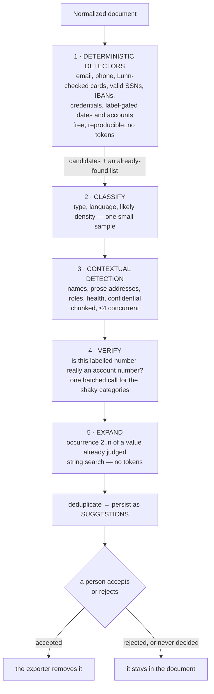

# The redaction engine

`lib/redaction/*`, `lib/ai/*`

Two ideas run through this whole layer:

1. **The model proposes; it never applies.** Nothing it returns changes a
   document. It points at text, a person decides, and deterministic code does the
   removing.
2. **Ask the model only what only a model can answer.** A regular expression can
   tell that a string is an email address. It cannot tell whether *Apple* is a
   fruit, a company, or a customer. Spending tokens on the first question is
   waste; spending them on the second is the point.

---

## 1. The pipeline



Steps 1 and 5 cost nothing. Steps 2 to 4 are the only ones that spend tokens,
and step 3 is told not to repeat what pattern matching already found.

### Cost, concretely

For a document mentioning `john@example.com` seventeen times:

| Approach | Model calls |
| --- | --- |
| Naive (ask per occurrence) | 17 |
| Ask once per chunk | ~1 per chunk containing it |
| **This pipeline** | **0** — the regex matched, and step 5 found the rest |

For a name the regex cannot recognize, the model answers **once**, and the other
sixteen occurrences are found by a local string search. Occurrence 2..n costs a
scan, not a request — and, just as importantly, cannot come back with a different
answer than occurrence 1.

---

## 2. Deterministic detectors

`lib/redaction/detectors.ts`

Each detector is a pattern plus, where it matters, a validator. The validators
are what keep the list from being noise:

| Category | Pattern guard |
| --- | --- |
| `financial` | **Luhn check.** An order number is not a payment card. |
| `government-id` | Structural validity — area ≠ `000`/`666`, group ≠ `00`. |
| `bank-account` | A bare 11-digit number is only an account if *labelled* as one. |
| `date-of-birth` | A date is only a birth date if preceded by `DOB`/`born`/etc. |
| `customer-id` | `ACME-88231` is a part number unless labelled `Customer ID`. |
| `url` | Only links carrying a token or a private path — docs links are noise. |
| `phone` | At least nine digits, so `Room 12 at 9am` does not match. |

Overlaps are resolved in favour of the higher-confidence detector, so a card
number is reported once as a card rather than also as a phone number.

The patterns are module-level with the `g` flag, so `lastIndex` is reset before
each use — a stateful regex silently returning different results on its second
call is a classic and very quiet bug. There is a test for it.

---

## 3. Talking to the model

`lib/ai/gateway.ts`, `lib/ai/prompts/*`, `lib/ai/schemas/*`

Everything goes through the AI Gateway by model id, so swapping models is
configuration rather than a code change. The default is a small, fast,
vision-capable model — the shape of work here is many short structured
extractions, not long reasoning.

**Structured output only.** Every call passes a Zod schema; output that does not
validate is discarded. No prose is parsed, and there is no "try to find the JSON
in the response" path.

**Located, not trusted.** The model returns the *text it saw*, never an offset.
The application then finds that text in the source itself:

```ts
const located = locateInPage(chunk.text, detection.text)
if (!located) continue   // the model named text that is not there — drop it
```

This is the guard against the failure mode that matters most: a model that
paraphrases, corrects a typo, or invents a plausible value cannot inject it into
the document, because a detection that cannot be located is discarded rather than
guessed at. Whitespace is allowed to differ (extracted text is unreliable about
it); the characters are not.

**Failure is contained.** A provider error returns `null`, not an exception.
Detection is an assist; losing it must never cost the user the document. Without
`AI_GATEWAY_API_KEY` the whole layer short-circuits and the product still works:
deterministic detection, manual redaction, global rules, and export all run.

**But the reason is not lost.** `null` used to be the whole answer, and a rate
limit, an empty balance, a bad key and a malformed response all arrived at the
caller identically — so a document reviewed against pattern matching alone was
indistinguishable from one the model genuinely found nothing in. That is this
codebase's own worst failure mode arriving with a clean exit code. Every result
now carries `skipped`, the analysis tallies them, and a run that fell short
writes a `document.ai.degraded` event which the usage panel reads back and says
out loud.

**Paced, then retried.** `lib/services/throttle.ts` sits in front of every call.
`ANONIFY_AI_CONCURRENCY` bounds how many are in flight *across every document* —
it used to be a constant applied per document, so six documents at once meant
twenty-four concurrent calls and the number the provider saw was one nobody had
chosen. A `429`, `5xx` or timeout is retried with jitter, honouring
`Retry-After`; a `401`, `402` or `403` is not retried at all, because no number
of tries fixes a bad key or an empty balance.

**A budget, because the gateway meters spend.** The AI Gateway has a credit
balance and a budget rather than a requests-per-minute number, so the ceiling
worth enforcing is one the application applies to itself before the money is
spent. `ANONIFY_AI_DAILY_SPEND_USD` is estimated from the `AiUsage` rows written
on every call and the `AI_PRICE_*` rates: at 80% the gateway drops to one call
at a time, and at 100% the contextual pass is skipped for the rest of the UTC
day — the same posture as no key at all, and said rather than swallowed. It is
opt-in and defaults to no cap, because a budget nobody set must never silently
stop a redaction, and an install without prices cannot have one at all.

**Prompts are never logged.** They contain the document. Logs carry model, task,
duration, token counts and an error category — nothing else.

---

## 4. What is asked, per task

| Task | Sees | Returns |
| --- | --- | --- |
| `classify` | ~2 KB opening sample | type, language, density |
| `detect` | one ~6 KB chunk + values already found | verbatim spans, category, confidence, `global` |
| `verify` | low-confidence candidates + 80 chars of context each | one verdict per candidate, batched |
| `columns` | headers + 5 sample values per column | which columns are sensitive, and why |
| `image` | the pixels + OCR text for context | regions in normalized 0–1 coordinates |

Two prompt decisions worth calling out:

- **Spreadsheets are analyzed by column, not by cell.** Headers plus a handful of
  samples is enough to judge a column, and "this column is sensitive" is both far
  cheaper and closer to the decision a reviewer actually wants to make than ten
  thousand individual answers.
- **Face regions are asked for as the whole head.** The prompt says so explicitly,
  because covering only the eyes does not reliably anonymize anyone. The prompt
  also asks for generous bounds: slightly too large is recoverable, slightly too
  small is a leak.

Coordinates come back normalized to 0–1 so the model never reasons about pixel
dimensions; the application scales them once.

---

## 5. Suggestion → decision → removal

```
Detection ──▶ Redaction{ status: "suggested" }
                  │
      user ───────┼──▶ accepted ──▶ counts at export
                  └──▶ rejected ──▶ ignored forever
```

The exporter reads only `accepted`. Nothing else can reach the file.

**Global rules** (`POST /api/documents/:id/rules`) are the same mechanism at
scale: "redact every occurrence of John Smith" searches the normalized document
**on the server**, writes one accepted redaction per hit, and never consults a
model. Deleting the rule removes exactly the redactions it created.

**Undo** keeps snapshots of the redaction map. The snapshot materializes Immer's
draft into plain values first — spreading the draft directly stores references
that the next mutation edits, and undo then restores the state it was meant to
replace. That was a real bug, caught by a test.

---

## 6. Applying, per format

`lib/redaction/apply.ts` turns accepted redactions into format-specific
instructions. The interesting part is mapping *offsets* onto *structure*:

- **DOCX** — page-level offsets map onto the runs that produced them. A value
  straddling several runs (Word splits at every formatting change) gives each run
  exactly the slice it contributed.
- **PDF** — offsets map onto glyph boxes, scaled across the span so redacting one
  word does not black out the line. Boxes are padded 1.5pt, because glyph extents
  are tight around the ink and a surviving hairline at the edge of a black box is
  a leak.
- **XLSX** — addresses, not offsets: cell, row, or column.
- **Images** — geometry directly, or OCR span boxes for a text redaction.

Alongside the precise edits, every export carries a **value sweep**: the accepted
strings are removed wherever else they appear in the container. That is what
catches a name in a DOCX header the editor never displayed, or an email in a
hidden worksheet.

---

## 7. Verification

`lib/redaction/validation.ts`

The export is re-opened and read the way an adversary would:

| Format | Read as |
| --- | --- |
| PDF | extracted text via pdf.js |
| DOCX | every `.xml` and `.rels` part, raw |
| XLSX | every cell of every sheet, plus every part |
| Image | (pixels carry no strings — the suite samples them instead) |

Any accepted value still present throws `ExportVerificationError`. The artifact
is **not saved**, no download link is issued, and the client is told the export
was refused. The operator's log records how many values leaked; the client is
told nothing that would help locate them.

Values shorter than four characters are not asserted on — they collide by
coincidence, and a check that fails at random is a check people learn to ignore.

---

## 8. What this engine does not claim

- **It does not find everything.** No detector does. The reviewer is the control,
  and the interface is built so that accepting is a deliberate act.
- **Confidence is a hint, not a probability.** It is shown as a band and a
  percentage so suggestions can be triaged — never as a verdict.
- **Verification proves absence of the accepted strings, not of the information.**
  If a document says *the CEO of the company on Elm Street*, removing the name
  does not remove the identification. That is a judgement call, and it belongs to
  the person reviewing.
