# Streaming I/O

`lib/storage/`, `lib/documents/`, `app/api/documents/[id]/content`, the download routes

What it means for Anonify to read a document without holding it, why that
matters on the machines Anonify runs on, and how each format gets there. Part
one ([#102](https://github.com/Anonify-v2-0/Anonify2.0/issues/102), shipped in
#127) built the primitives: the chunked envelope, ranged and streamed driver
reads, and a memory budget. Part two
([#129](https://github.com/Anonify-v2-0/Anonify2.0/issues/129)) is what this
document is mostly about: using them everywhere a whole object was still being
held.

> **A note on the numbers.** Figures marked *measured* are byte counts produced
> by `pnpm tsx scripts/streaming-figures.ts` over generated fixtures: what a code
> path reads, decodes or keeps. They are deterministic and can be re-run.
> Figures marked *modelled* are worked out from what each path allocates — a
> sealed buffer, a decrypted copy, an inflated archive — and are the theory
> this change is built on, not a profile of a running process. Nothing here is
> a benchmark in the sense of [CONTRIBUTING.md §4](../CONTRIBUTING.md#4-benchmarks).

---

## 1. The shape of the problem

Before part one, every stage that touched a document did the same thing: fetch
the sealed object, decrypt it whole, parse it whole, and write the result whole.

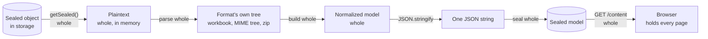
```mermaid
flowchart LR
    S[("Sealed object<br/>in storage")] -->|"getSealed()<br/>whole"| P["Plaintext<br/>whole, in memory"]
    P -->|"parse whole"| T["Format's own tree<br/>workbook, MIME tree, zip"]
    T -->|"build whole"| M["Normalized model<br/>whole"]
    M -->|"JSON.stringify"| J["One JSON string"]
    J -->|"seal whole"| S2[("Sealed model")]
    S2 -->|"GET /content<br/>whole"| B["Browser<br/>holds every page"]
```

Each arrow is a full copy, and several are alive at once. For a 50 MiB file that
is a few hundred megabytes for one document — and Anonify processes several at
once. The memory a deployment needs was set by its largest document times its
concurrency, not by the work.

After part two, each stage reads the part of the object it needs, when it needs
it:

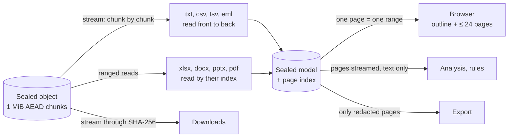
```mermaid
flowchart LR
    S[("Sealed object<br/>1 MiB AEAD chunks")]
    S -->|"stream: chunk by chunk"| X1["txt, csv, tsv, eml<br/>read front to back"]
    S -->|"ranged reads"| X2["xlsx, docx, pptx, pdf<br/>read by their index"]
    X1 --> M[("Sealed model<br/>+ page index")]
    X2 --> M
    M -->|"one page = one range"| B["Browser<br/>outline + ≤ 24 pages"]
    M -->|"pages streamed, text only"| A["Analysis, rules"]
    M -->|"only redacted pages"| E["Export"]
    S -->|"stream through SHA-256"| D["Downloads"]
```

---

## 2. Why it matters: the budget

Part one stated the constraint once, as the product that matters:

```
chunkBytes × maxInFlightChunks × processingConcurrency() ≤ memoryBudget
```

A streamed reader's footprint is bounded by the first two factors — a
megabyte chunk, eight or sixteen of them in flight — whatever the document's
size. A whole-object reader's footprint is the document, times however many
copies the path makes. Multiply either by the documents processing at once and
the difference is the difference between a deployment sized by its budget and
one sized by its worst upload.

*Modelled:* six documents processing at once (the self-hosted default), each a
50 MiB deck. The whole-file path holds the sealed object, the decrypted file
and every inflated part (≈150 MiB per document); the ranged path holds its
share of the budget (16 × 1 MiB) and the deck's XML (≈1 MiB).

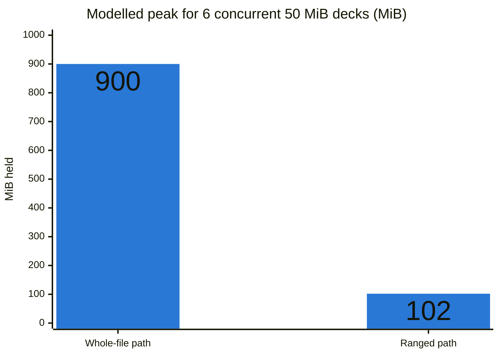
```mermaid
%%{init: {"xyChart": {"showDataLabel": true}, "themeVariables": {"xyChart": {"plotColorPalette": "#2a78d6"}}}}%%
xychart-beta
    title "Modelled peak for 6 concurrent 50 MiB decks (MiB)"
    x-axis ["Whole-file path", "Ranged path"]
    y-axis "MiB held" 0 --> 1000
    bar [900, 102]
```

| Path | Per document | × 6 documents |
| --- | ---: | ---: |
| Whole file: sealed + plaintext + inflated parts | ≈ 150 MiB | ≈ 900 MiB |
| Ranged: budget share + XML parts | ≈ 17 MiB | ≈ 102 MiB |

On a 2 GB serverless function that is the difference between room to spare and
an out-of-memory kill that the workflow retries into the same wall.

---

## 3. The normalized model, a page at a time

### The layout

The model is stored exactly as it always was — one JSON document,
byte-for-byte `JSON.stringify(model)` — so anything that reads it whole still
does. What is new is an index beside it, `Document.normalizedIndex`, recording
where each page's JSON sits:

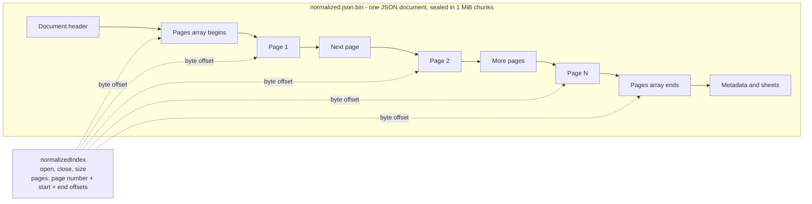
```mermaid
flowchart LR
    subgraph JSON["normalized.json.bin - one JSON document, sealed in 1 MiB chunks"]
        direction LR

        H["Document header"] --> O["Pages array begins"]
        O --> P1["Page 1"]
        P1 --> C1["Next page"]
        C1 --> P2["Page 2"]
        P2 --> C2["More pages"]
        C2 --> PN["Page N"]
        PN --> CL["Pages array ends"]
        CL --> T["Metadata and sheets"]
    end

    I["normalizedIndex<br/>open, close, size<br/>pages: page number + start + end offsets"]

    I -.->|"byte offset"| O
    I -.->|"byte offset"| P1
    I -.->|"byte offset"| P2
    I -.->|"byte offset"| PN
    I -.->|"byte offset"| CL
```

- **A page** is `range(start, end)` — one ranged read of the chunks covering
  it, each chunk authenticated before a byte of it is used.
- **The outline** is the bytes before `[` and after `]`: everything but the
  pages. For a paged document that is a few hundred bytes; for a workbook it
  carries the sheets.
- **Every page in order** is one streamed read, cut at the index's offsets as
  it passes, holding a page and a chunk.

The index holds offsets and page numbers and nothing else, which is why it can
sit in the database beside the key of the object it describes. It is written
in the same update as that key, so a retried extraction cannot leave one
model's key beside another model's offsets. A page that parses and is not the
page asked for is refused rather than served. A model written before the index
existed has none and is read whole, exactly as before.

Both writers produce the index the same way (`NormalizedJsonWriter`): the
whole-model serializer, and the extractors that stream a model out a page at a
time. `tests/normalized-pages.test.ts` holds them to each other and to
`JSON.stringify`.

### The editor

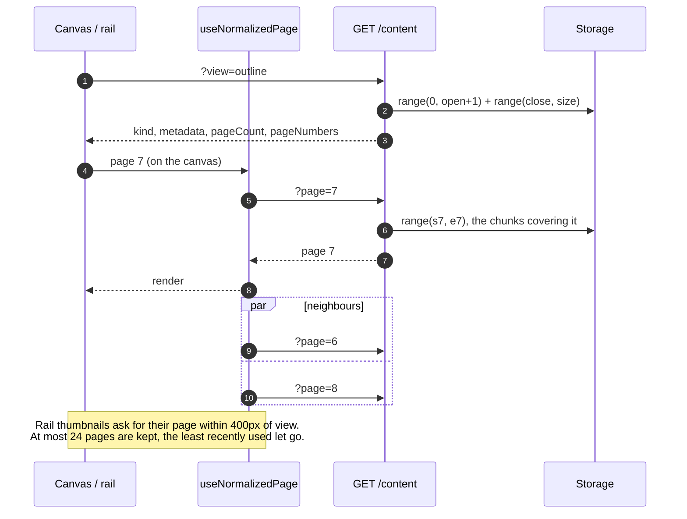
```mermaid
sequenceDiagram
    autonumber
    participant C as Canvas / rail
    participant H as useNormalizedPage
    participant R as GET /content
    participant S as Storage

    C->>R: ?view=outline
    R->>S: range(0, open+1) + range(close, size)
    R-->>C: kind, metadata, pageCount, pageNumbers
    C->>H: page 7 (on the canvas)
    H->>R: ?page=7
    R->>S: range(s7, e7), the chunks covering it
    R-->>H: page 7
    H-->>C: render
    par neighbours
        H->>R: ?page=6
    and
        H->>R: ?page=8
    end
    Note over C,H: Rail thumbnails ask for their page within 400px of view.<br/>At most 24 pages are kept, the least recently used let go.
```

*Measured:* a 100,000-line text file pages out to 1,992 pages. Its model is
17.4 MB.

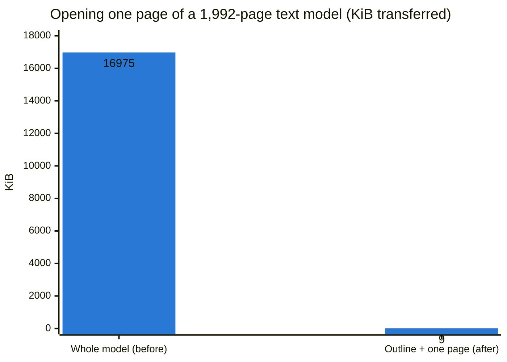
```mermaid
%%{init: {"xyChart": {"showDataLabel": true}, "themeVariables": {"xyChart": {"plotColorPalette": "#2a78d6"}}}}%%
xychart-beta
    title "Opening one page of a 1,992-page text model (KiB transferred)"
    x-axis ["Whole model (before)", "Outline + one page (after)"]
    y-axis "KiB" 0 --> 18000
    bar [16975, 9]
```

| | Before | After |
| --- | ---: | ---: |
| To show the first page | 17,382,639 bytes | 132 + 9,014 bytes |
| Held by the editor | the whole model | the outline and ≤ 24 pages (≤ ≈ 216 KB) |

### The server's readers

Three server-side readers loaded the model whole after extraction; none do now.

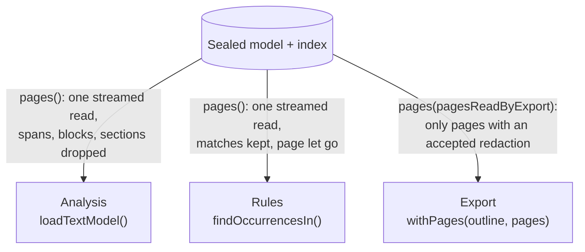
```mermaid
flowchart TB
    M[("Sealed model + index")]
    M -->|"pages(): one streamed read,<br/>spans, blocks, sections dropped"| A["Analysis<br/>loadTextModel()"]
    M -->|"pages(): one streamed read,<br/>matches kept, page let go"| R["Rules<br/>findOccurrencesIn()"]
    M -->|"pages(pagesReadByExport):<br/>only pages with an accepted redaction"| E["Export<br/>withPages(outline, pages)"]
```

- **Analysis** reads `page.text` and never a span, a block or a section — and
  those are most of a model, because a PDF span carries a box and an offset per
  character. It gets every page's text and nothing else.
- **Rules** search a page at a time and keep only what matched, in exactly the
  order `findAllOccurrences` produced.
- **Export** reads the pages something is removed from. Every plan builder
  looks a page up by `redaction.page ?? 1` for an accepted redaction, and the
  image plan reads the first page, so `pagesReadByExport` names exactly those.
  A three-thousand-page file with one redaction on page twelve reads page
  twelve. The test builds every format's plan from those pages and from all of
  them and requires the two to be identical.

---

## 4. Archives read by their index

### Why a zip is read from the end

Word documents, decks and workbooks are zip archives, and a zip's table of
contents — the central directory — is at the end. Both whole-file parsers
(`unzipSync` for Word and PowerPoint, JSZip inside exceljs) read it from there
and then inflate *every* entry before anyone looks at one.

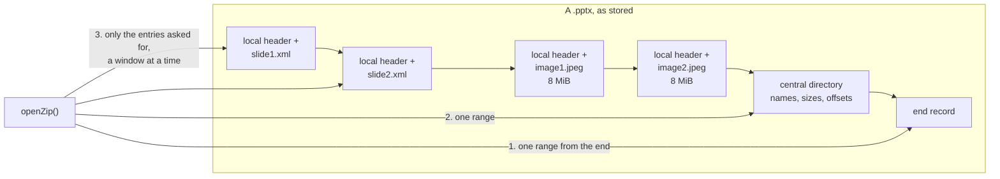
```mermaid
flowchart LR
    subgraph ZIP["A .pptx, as stored"]
        direction LR
        L1["local header +<br/>slide1.xml"] --> L2["local header +<br/>slide2.xml"] --> L3["local header +<br/>image1.jpeg<br/>8 MiB"] --> L4["local header +<br/>image2.jpeg<br/>8 MiB"] --> CD["central directory<br/>names, sizes, offsets"] --> EOCD["end record"]
    end
    R["openZip()"] -->|"1. one range from the end"| EOCD
    R -->|"2. one range"| CD
    R -->|"3. only the entries asked for,<br/>a window at a time"| L1
    R --> L2
```

`lib/documents/ooxml/zip.ts` does the first two steps with two ranged reads and
then inflates only the entries it is asked for, 256 KiB at a time, through a
`pipeline` that stops reading when the reader stops.

### When it refuses

Zips are a format where parsers famously disagree, and the ranged reader exists
to produce exactly what the whole-file parser would. So it does not pick an
answer where the two whole-file parsers could differ — it throws
`ZipFallback`, and the workflow extracts the file whole, as it always did.

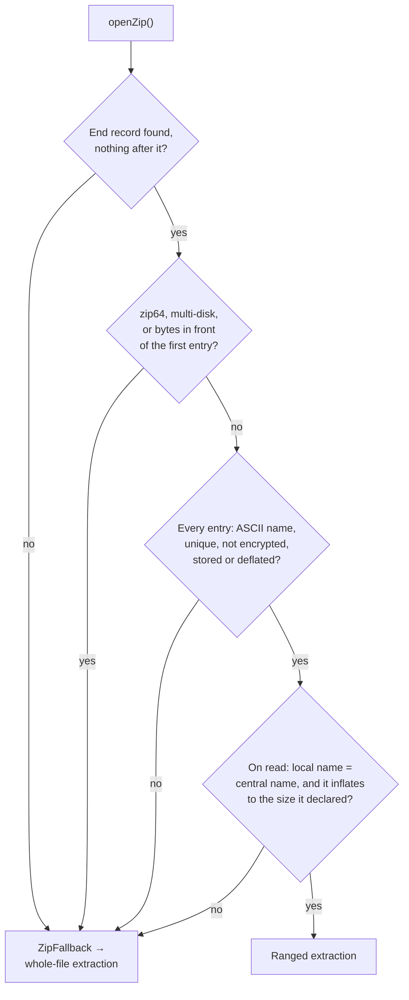
```mermaid
flowchart TD
    A["openZip()"] --> B{"End record found,<br/>nothing after it?"}
    B -- no --> F["ZipFallback →<br/>whole-file extraction"]
    B -- yes --> C{"zip64, multi-disk,<br/>or bytes in front<br/>of the first entry?"}
    C -- yes --> F
    C -- no --> D{"Every entry: ASCII name,<br/>unique, not encrypted,<br/>stored or deflated?"}
    D -- no --> F
    D -- yes --> E{"On read: local name =<br/>central name, and it inflates<br/>to the size it declared?"}
    E -- no --> F
    E -- yes --> G["Ranged extraction"]
```

An archive a real office suite wrote passes every check; one that does not was
never going to be a streaming win. `tests/zip-reader.test.ts` checks both
halves: every entry of every fixture inflates to exactly what `unzipSync`
gives, at any window, and each refusal fires.

### Reading small parts cheaply

A ranged read of a sealed object fetches and authenticates every chunk it
touches. Fifty small parts inside one megabyte would fetch that megabyte fifty
times, so ranged readers go through `cachedRangeSource`, which widens reads to
whole chunks and keeps the last four:

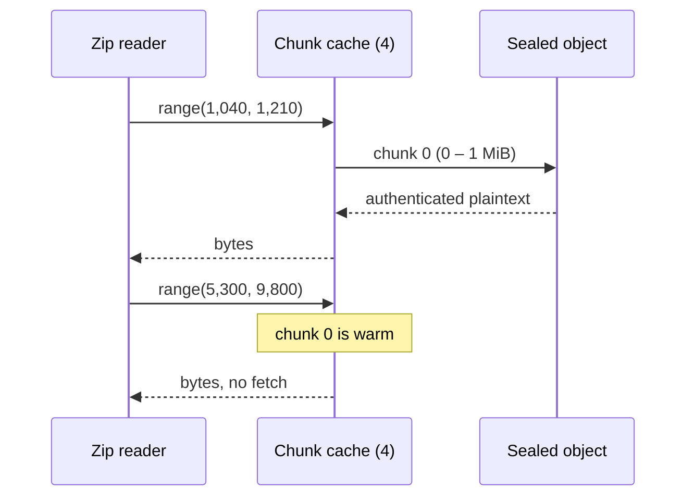
```mermaid
sequenceDiagram
    participant Z as Zip reader
    participant C as Chunk cache (4)
    participant O as Sealed object
    Z->>C: range(1,040, 1,210)
    C->>O: chunk 0 (0 – 1 MiB)
    O-->>C: authenticated plaintext
    C-->>Z: bytes
    Z->>C: range(5,300, 9,800)
    Note over C: chunk 0 is warm
    C-->>Z: bytes, no fetch
```

### Word documents and decks: XML parts only

Extraction reads XML and relationship parts and nothing else. The ranged path
opens the package with only those held; pictures, fonts and embeddings are
inflated and let go (so a corrupt one still fails where it always failed), and
left as names that throw if anything reads them, so an extractor that starts
reading one fails loudly instead of finding it empty.

*Measured:* a deck with two slides and two 8 MiB photographs.

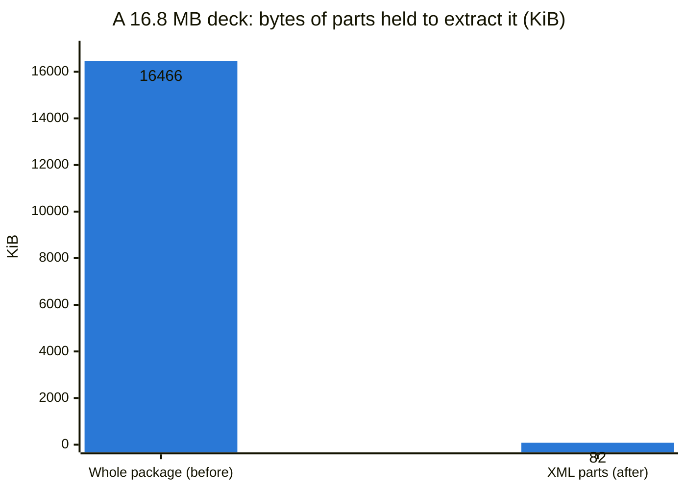
```mermaid
%%{init: {"xyChart": {"showDataLabel": true}, "themeVariables": {"xyChart": {"plotColorPalette": "#2a78d6"}}}}%%
xychart-beta
    title "A 16.8 MB deck: bytes of parts held to extract it (KiB)"
    x-axis ["Whole package (before)", "XML parts (after)"]
    y-axis "KiB" 0 --> 17000
    bar [16466, 82]
```

| | Before | After |
| --- | ---: | ---: |
| Source held | 16,781,589 bytes | none — ranged reads |
| Parts held | 16,861,305 bytes (every part) | 84,089 bytes (XML only) |

---

## 5. Workbooks, one worksheet at a time

### Why not exceljs's streaming reader

exceljs ships a streaming `WorkbookReader`, and #129 suggested it. It turned out
to be unusable here:

| | exceljs `WorkbookReader` | What Anonify needs |
| --- | --- | --- |
| `sharedStrings.xml` after the sheets (Excel's usual order) | spills every worksheet to a **plaintext temp file** | decrypted content never on disk |
| Hidden rows and columns | not read | reported to the reviewer — hidden data is where redactions are missed |
| Merged cells | dropped | carried, as the whole-file path carries them |
| Shared formulas | empty formula text | the translated formula |
| Sheet order | order in the zip | order in the workbook |

### What it does instead

`lib/documents/xlsx/stream.ts` drives exceljs's *own* whole-file machinery —
the same xforms, the same reconcile, the same `Worksheet` — over the same parts
in the same order, with one difference: a worksheet is parsed when it is about
to be written, and released once it has been.

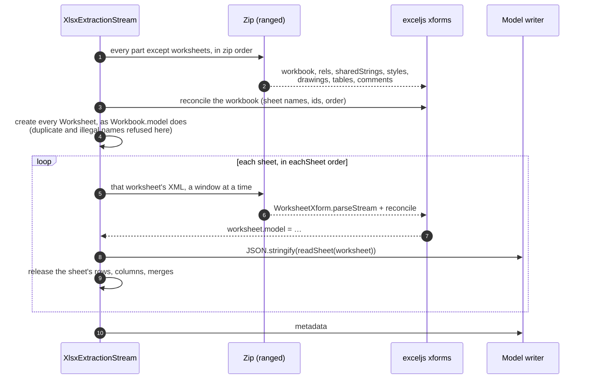
```mermaid
sequenceDiagram
    autonumber
    participant X as XlsxExtractionStream
    participant Z as Zip (ranged)
    participant E as exceljs xforms
    participant W as Model writer

    X->>Z: every part except worksheets, in zip order
    Z-->>E: workbook, rels, sharedStrings, styles,<br/>drawings, tables, comments
    X->>E: reconcile the workbook (sheet names, ids, order)
    X->>X: create every Worksheet, as Workbook.model does<br/>(duplicate and illegal names refused here)
    loop each sheet, in eachSheet order
        X->>Z: that worksheet's XML, a window at a time
        Z-->>E: WorksheetXform.parseStream + reconcile
        E-->>X: worksheet.model = …
        X->>W: JSON.stringify(readSheet(worksheet))
        X->>X: release the sheet's rows, columns, merges
    end
    X->>W: metadata
```

What it writes is `JSON.stringify(extractXlsx(...).document)`, character for
character: `tests/xlsx-stream.test.ts` checks that for every cell type, every
way a sheet can be hidden, merges, shared formulas, dates, hyperlinks, inline
and shared strings, and archives with their parts reversed or with the shared
strings last.

*Modelled:* exceljs's object model costs several hundred bytes per cell, for
every cell of every sheet at once. Held one sheet at a time, the peak is the
largest sheet plus the shared strings — for a workbook of *n* equally sized
sheets, roughly 1/*n* of the whole-file peak.

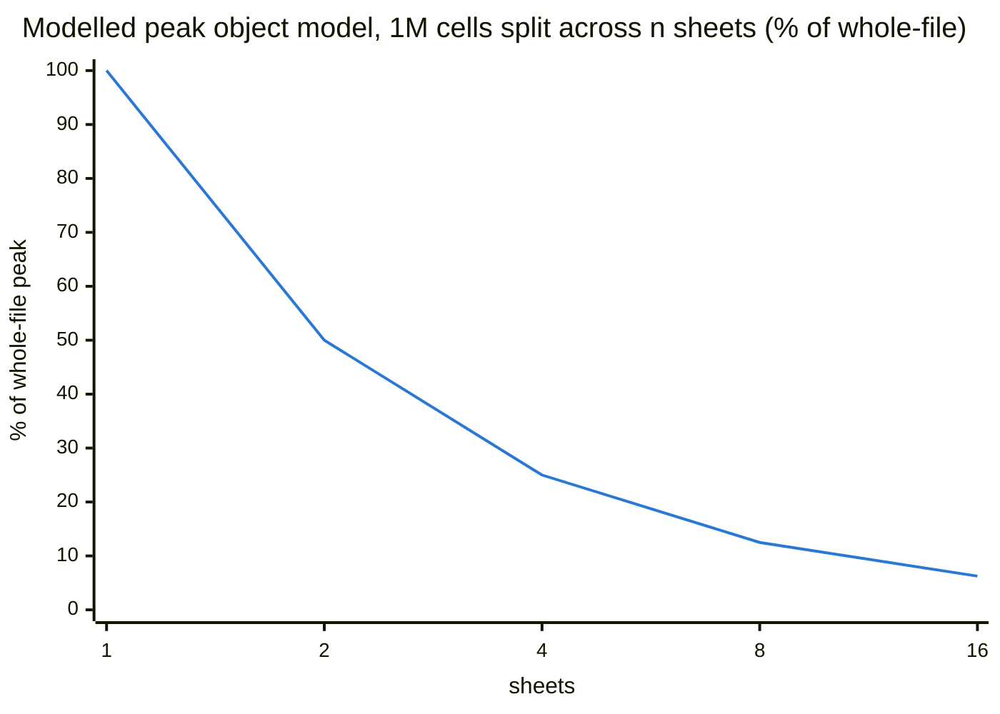
```mermaid
%%{init: {"xyChart": {"showDataLabel": true}, "themeVariables": {"xyChart": {"plotColorPalette": "#2a78d6"}}}}%%
xychart-beta
    title "Modelled peak object model, 1M cells split across n sheets (% of whole-file)"
    x-axis "sheets" ["1", "2", "4", "8", "16"]
    y-axis "% of whole-file peak" 0 --> 100
    line [100, 50, 25, 12.5, 6.25]
```

---

## 6. Messages, scanned forward

### The problem

The MIME parser split a message recursively: find a multipart's delimiters
across its whole body, then parse each part the same way. That needs the whole
message as one string — and a message's attachments are nearly always most of
it. *Measured:* a 34.4 MB message carrying one PDF was held twice, as bytes and
as the Latin-1 string the parser worked on.

### A forward scan with a boundary stack

`lib/documents/eml/scan.ts` reads the message once, a line at a time, with the
delimiter of every open multipart on a stack. It keeps header blocks and text
parts, and lets attachment bodies go past; their nodes record where they were,
and whatever needs one reads that range back from storage.

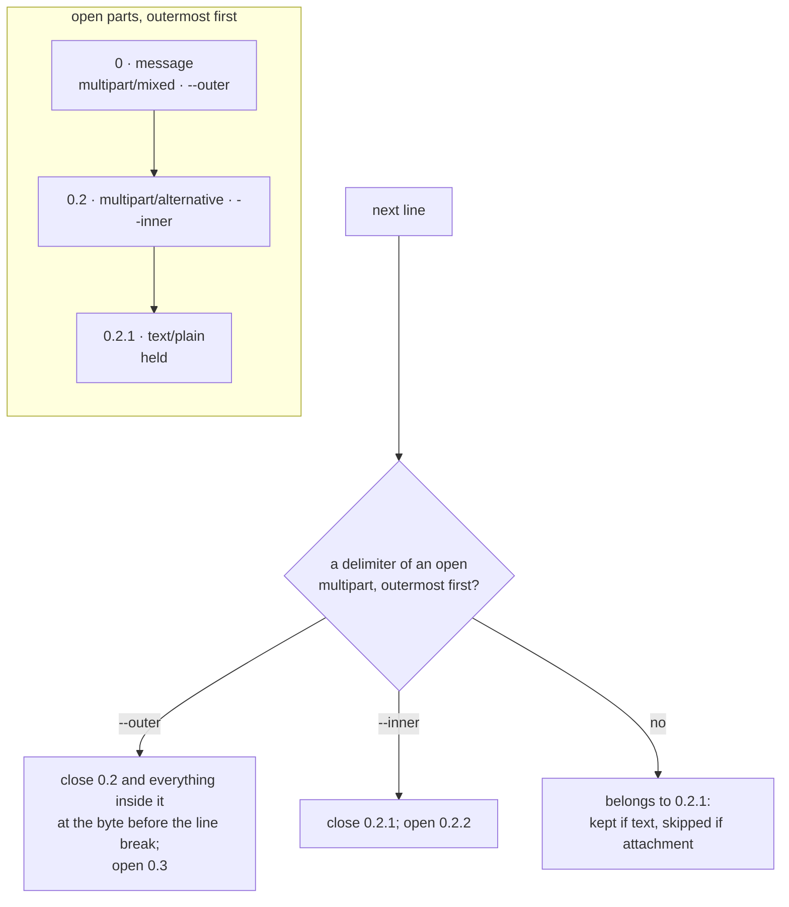
```mermaid
flowchart TB
    subgraph STACK["open parts, outermost first"]
        direction TB
        R["0 · message<br/>multipart/mixed · --outer"]
        M["0.2 · multipart/alternative · --inner"]
        T["0.2.1 · text/plain<br/>held"]
        R --> M --> T
    end
    L["next line"] --> Q{"a delimiter of an open<br/>multipart, outermost first?"}
    Q -- "--outer" --> CO["close 0.2 and everything inside it<br/>at the byte before the line break;<br/>open 0.3"]
    Q -- "--inner" --> CI["close 0.2.1; open 0.2.2"]
    Q -- no --> B["belongs to 0.2.1:<br/>kept if text, skipped if attachment"]
```

Each part moves through a small life cycle:

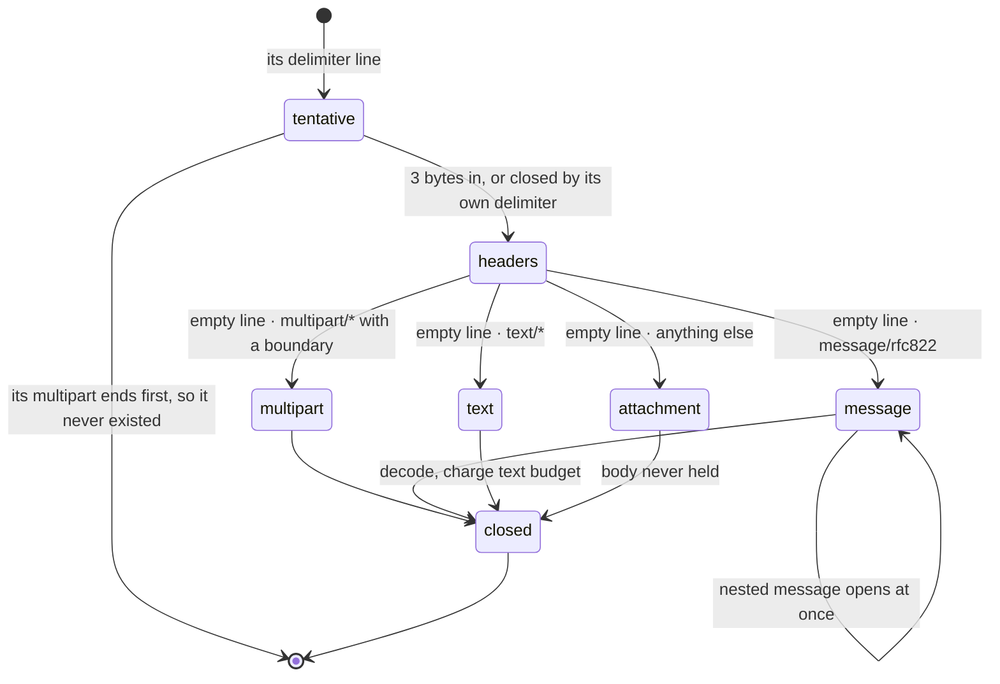
```mermaid
stateDiagram-v2
    [*] --> tentative: its delimiter line
    tentative --> headers: 3 bytes in, or closed by its own delimiter
    tentative --> [*]: its multipart ends first, so it never existed
    headers --> multipart: empty line · multipart/* with a boundary
    headers --> message: empty line · message/rfc822
    headers --> text: empty line · text/*
    headers --> attachment: empty line · anything else
    message --> message: nested message opens at once
    multipart --> closed
    message --> closed
    text --> closed: decode, charge text budget
    attachment --> closed: body never held
    closed --> [*]
```

### Byte for byte, quirks included

The exporter edits the original message by these offsets and the address map
resolves every reviewed span through them, so "close" is a leak or a corrupted
message. The scanner therefore does not re-read RFC 2046; it reproduces the
recursive parser exactly, including where that parser was idiosyncratic:

| Behaviour | Why it has to be kept |
| --- | --- |
| An enclosing multipart's delimiter always wins | the outer body was split first, so an inner part never saw an outer delimiter |
| A part ends before the CRLF or LF preceding the delimiter | every part's `end` |
| Headers end at the first `\n` *at or after* the part's start followed by an empty line | a blank first line does not end them; a header block running into the delimiter's CRLF ends one or two bytes past its part |
| A part closed by its own delimiter exists however short; a last part with no closing delimiter exists only if it holds a byte | which parts exist, and so every later path number |
| An all-whitespace message is "empty" before any limit is checked | which refusal the reviewer is shown |

`parseEml` now runs on the scanner too, so the exporter (which has the message
in hand) and the extractor (which streams it) share one implementation and
cannot drift apart.

### How it is held to the old parser

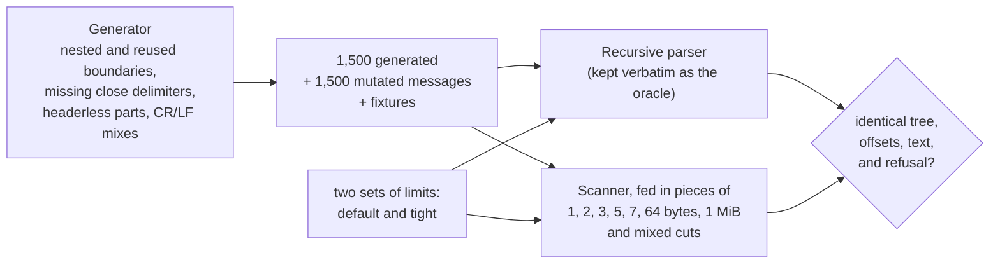
```mermaid
flowchart LR
    G["Generator<br/>nested and reused boundaries,<br/>missing close delimiters,<br/>headerless parts, CR/LF mixes"] --> MSG["1,500 generated<br/>+ 1,500 mutated messages<br/>+ fixtures"]
    MSG --> O["Recursive parser<br/>(kept verbatim as the oracle)"]
    MSG --> S["Scanner, fed in pieces of<br/>1, 2, 3, 5, 7, 64 bytes, 1 MiB<br/>and mixed cuts"]
    O --> EQ{"identical tree,<br/>offsets, text,<br/>and refusal?"}
    S --> EQ
    L["two sets of limits:<br/>default and tight"] --> O
    L --> S
```

`tests/eml-scan.test.ts` also asserts that the corpus actually reaches each
quirk more than five times — a body starting past its end, a part starting past
its end, refusals, attachments, nested messages, headerless parts — so the
comparison proves something about each. Targeted mutants of the scanner (not
stripping the CR, innermost-first delimiter matching, a blank first line
ending headers, an empty last part existing) all fail it.

*Measured:* the scanner keeps 10 bytes between pieces of that 34.4 MB message.
It is handed a piece at a time — a storage chunk, a megabyte — and keeps a line
of it.

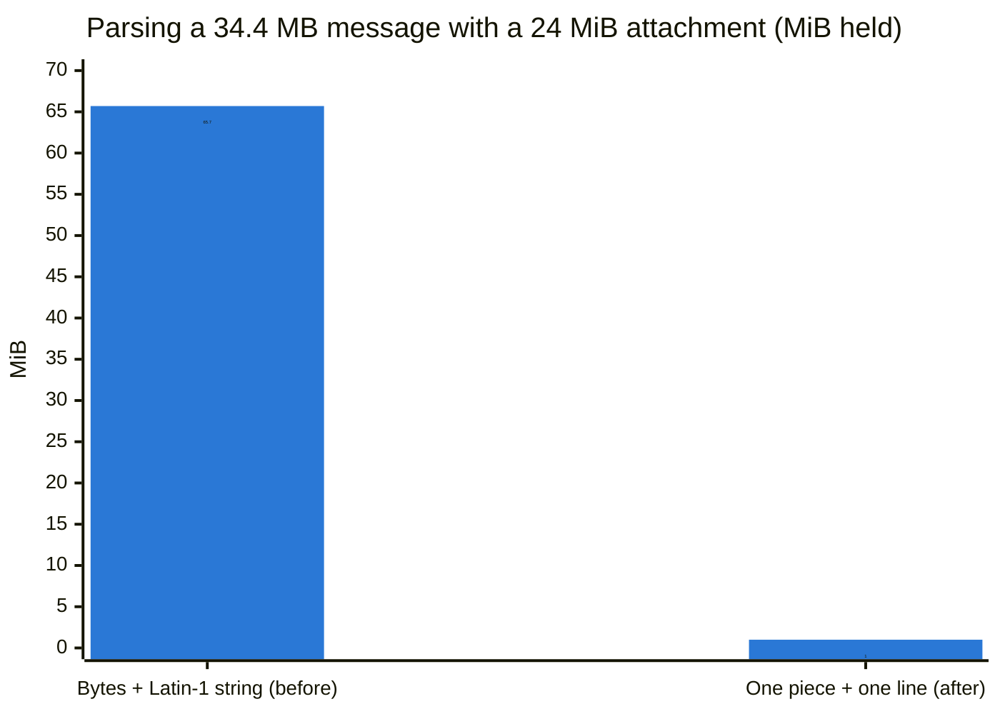
```mermaid
%%{init: {"xyChart": {"showDataLabel": true}, "themeVariables": {"xyChart": {"plotColorPalette": "#2a78d6"}}}}%%
xychart-beta
    title "Parsing a 34.4 MB message with a 24 MiB attachment (MiB held)"
    x-axis ["Bytes + Latin-1 string (before)", "One piece + one line (after)"]
    y-axis "MiB" 0 --> 70
    bar [65.7, 1]
```

Extraction scans the sealed source as it streams and hashes it in the same
read; a message the scanner refuses is read to the end anyway, so a corrupt
source is reported as corrupt first, as the whole-file path reported it.
Attachment expansion scans the message and then reads each attachment by its
range to size and sniff it, one at a time.

---

## 7. PDFs over ranged reads

A PDF cannot be read front to back either: its cross-reference table is at the
end. pdf.js is handed a `PDFDataRangeTransport` backed by the chunk cache
instead of the decrypted file, with auto-fetch and streaming off, so it asks
for the ranges it parses and nothing else.

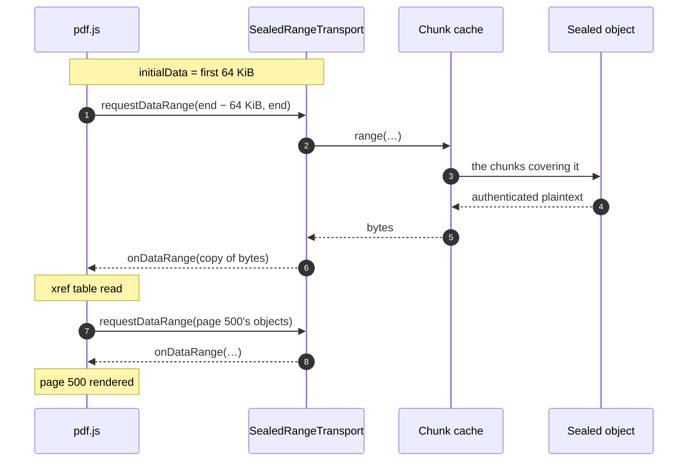
```mermaid
sequenceDiagram
    autonumber
    participant J as pdf.js
    participant T as SealedRangeTransport
    participant C as Chunk cache
    participant S as Sealed object

    Note over J,T: initialData = first 64 KiB
    J->>T: requestDataRange(end − 64 KiB, end)
    T->>C: range(…)
    C->>S: the chunks covering it
    S-->>C: authenticated plaintext
    C-->>T: bytes
    T-->>J: onDataRange(copy of bytes)
    Note over J: xref table read
    J->>T: requestDataRange(page 500's objects)
    T-->>J: onDataRange(…)
    Note over J: page 500 rendered
```

Two things the transport has to handle that pdf.js does not:

- **A failed read.** pdf.js's transport has no way to report one, and
  destroying the loading task does not settle everything waiting on it — so a
  storage error would hang extraction. The work is raced against the failure
  instead (`guard`), which rejects with the read that failed.
- **Transferred buffers.** pdf.js may transfer what it is handed, which
  detaches it — and the bytes are a chunk the cache is still holding. Every
  range is copied before it is handed over.

*Measured:* rendering one page of a 1,000-page, 1.03 MB PDF for the vision pass.

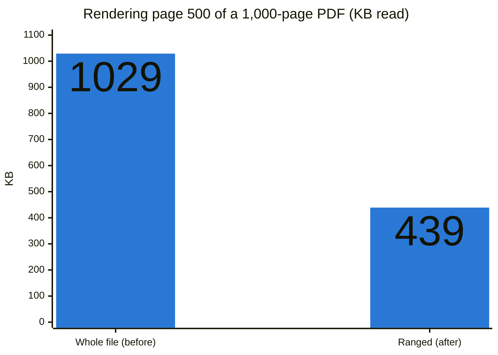
```mermaid
%%{init: {"xyChart": {"showDataLabel": true}, "themeVariables": {"xyChart": {"plotColorPalette": "#2a78d6"}}}}%%
xychart-beta
    title "Rendering page 500 of a 1,000-page PDF (KB read)"
    x-axis ["Whole file (before)", "Ranged (after)"]
    y-axis "KB" 0 --> 1100
    bar [1029, 439]
```

The saving grows with the document: the index and the page's objects are read,
the other 999 pages' content streams are not. pdf.js does keep what it fetches,
in a buffer the length of the file that fills as it goes, so extraction — which
reads every page — gains the decrypted copy the byte path used to hand it, not
the whole file.

---

## 8. Downloads, verified as they stream

A download was decrypted whole, hashed, compared with the checksum recorded at
export, and only then served — the one order that promises nothing unverified
is delivered, at the cost of the whole artifact in memory per download.
Streamed, the hash is only known at the end, so the verifier holds the last
piece back until it is:

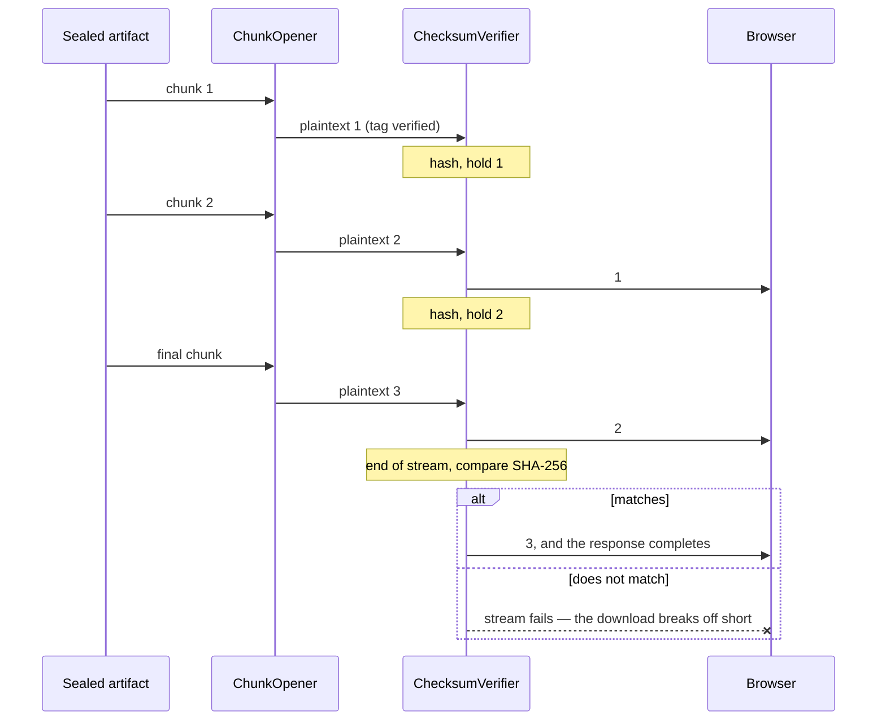
```mermaid
sequenceDiagram
    participant S as Sealed artifact
    participant O as ChunkOpener
    participant V as ChecksumVerifier
    participant B as Browser

    S->>O: chunk 1
    O->>V: plaintext 1 (tag verified)
    Note over V: hash, hold 1
    S->>O: chunk 2
    O->>V: plaintext 2
    V->>B: 1
    Note over V: hash, hold 2
    S->>O: final chunk
    O->>V: plaintext 3
    V->>B: 2
    Note over V: end of stream, compare SHA-256
    alt matches
        V->>B: 3, and the response completes
    else does not match
        V--xB: stream fails — the download breaks off short
    end
```

What the recipient holds after a mismatch is a download that broke off, never
a complete file that failed its check.

The batch archive keeps its old promise — an artifact that fails its check is
left out and *named*, not allowed to break the archive — which needs the
verdict before the first byte is sent. So it reads twice, holding nothing. A
mailbox rebuilt for the original-format download is one more file built the
same way: written once through the scanner that verifies it, keeping one
message at a time, then written again for delivery against the checksum that
pass computed (`lib/documents/mbox/rebuild.ts`). So a message of a rebuilt
mailbox is read three times — hashed, verified, delivered — where a file is
read twice, and the 150 MiB ceiling charges it for both reads after the hash.
`?part=report` runs the first two, because a report that says a mailbox
verified has to have verified it:

```mermaid
flowchart LR
    subgraph P1["Pass 1 — decide"]
        A1["each artifact"] -->|"stream through SHA-256,<br/>keep nothing"| D{"matches, and<br/>fits in 150 MiB?"}
        D -- yes --> IN["goes in"]
        D -- no --> SK["named as skipped<br/>in batch-report.json"]
    end
    subgraph P2["Pass 2 — send"]
        IN -->|"stream, checked again"| Z["fflate Zip,<br/>deflated as it is read"]
        Z --> BR["Browser"]
    end
```

*Modelled:* a single download held the sealed object and its plaintext (≈ 2×
the artifact); a batch held every artifact and then the zip of them.

```mermaid
%%{init: {"xyChart": {"showDataLabel": true}, "themeVariables": {"xyChart": {"plotColorPalette": "#2a78d6"}}}}%%
xychart-beta
    title "Modelled peak for a 150 MiB batch download (MiB)"
    x-axis ["Artifacts + zip (before)", "One piece + deflate window (after)"]
    y-axis "MiB" 0 --> 320
    bar [300, 3]
```

---

## 9. What still reads whole, and why

| Path | Why it is still whole |
| --- | --- |
| **Export** reads each source whole | pdf-lib, the OOXML writer (`zipSync`) and the redactors rebuild a whole artifact, and the verification gate re-opens that artifact adversarially. Exporting EML by ranges — copying untouched parts straight from storage — is possible now that the parser streams, but it moves invariant 4 (*every export is verified before delivery*) onto a streamed artifact, and belongs in its own change with its own review. |
| **Images** | memory is the decoded raster; streaming the file changes nothing. Not planned. |
| **RTF** | the parser is a state machine over the whole string; low value. Not planned. |
| **A workbook's sheets in the editor** | the grid renders every cell of a sheet, so the outline carries the sheets. Pages are indexed; cells are not yet. |
| **A message's text parts** | they are the text being reviewed, so they are the model. Only attachment bodies are left behind. |
| **`GET /content` with no query** | kept whole for compatibility. The editor no longer calls it. |

The invariants from #102 all still hold: no plaintext leaves a chunk before its
tag verifies; objects are write-once; the chunk counter fails closed;
`MAX_UPLOAD_BYTES` has not moved; and every streamed reader produces exactly
what its whole-file counterpart would — or, where it cannot be sure, hands the
work back to that counterpart.

---

## 10. Where each claim is checked

| Claim | Test |
| --- | --- |
| The model's JSON is unchanged, and every page is where the index says | `tests/normalized-pages.test.ts` |
| Pages, outline and whole read the same with an index as without, in both envelopes | `tests/normalized-pages.test.ts` |
| Rules and export reach the answer they reached over the whole model | `tests/normalized-pages.test.ts` |
| Every zip entry inflates exactly as `unzipSync` does; ambiguous archives are refused | `tests/zip-reader.test.ts` |
| A workbook streamed a sheet at a time serializes identically | `tests/xlsx-stream.test.ts` |
| Word and PowerPoint extraction over XML parts only is identical; skipped parts throw | `tests/ooxml-stream.test.ts` |
| PDF extraction and rendering by ranges are identical; a failed read fails, not hangs | `tests/pdf-ranged.test.ts` |
| The MIME scanner matches the recursive parser across 3,000 messages | `tests/eml-scan.test.ts` |
| A mismatched download never completes; the streamed archive carries the same entries | `tests/streamed-downloads.test.ts` |
| An abandoned read releases its file handle or socket | `tests/chunked.test.ts` |
| Vercel Blob honours ranges | `pnpm smoke:blob` (needs a store) |
| S3/RustFS honours ranges | `pnpm smoke:storage` (CI) |

## 11. Reproducing the measured figures

```
pnpm tsx scripts/streaming-figures.ts
```

```json
{
  "textModel": { "pages": 1992, "modelBytes": 17382639, "largestPageBytes": 9014, "outlineBytes": 132 },
  "pdfVision": { "fileBytes": 1029178, "readForOnePage": 439354 },
  "deck": { "fileBytes": 16781589, "inflatedWhole": 16861305, "heldRanged": 84089 },
  "message": { "messageBytes": 34437766, "retainedBetweenPieces": 10 }
}
```

The fixtures are generated in the script — no real documents — and the PDF and
deck contents are fixed or random-but-incompressible, so the counts are stable
to within a few bytes of PDF metadata.
